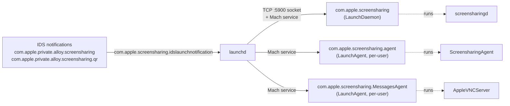

# Component Map

The Screen Sharing system is split across four binaries plus a set of private frameworks. This page documents what each component does, how launchd activates them, and the IPC edges between them.

## Process Map

```mermaid
flowchart TB
    subgraph Client["Client machine"]
        SSV["Shared Screen Viewer<br/>(viewer / UI)"]
    end
    subgraph Server["Server machine"]
        SSD["screensharingd<br/>(session / auth)"]
        SSA["ScreensharingAgent<br/>(media / UDP)"]
        AVS["AppleVNCServer<br/>(Messages-agent path)"]
    end
    subgraph Net["Network"]
        IDS["IDS / Apple ID relay"]
        Bonjour["Bonjour rfb /<br/>vnc-server"]
    end
    SSV -->|RFB 003.889<br/>TCP :5900| SSD
    SSV -.->|invitation / address| IDS
    IDS -.->|launch hint| SSD
    SSV -.->|Messages relay| AVS
    SSD <-->|Mach: ScreenChanges,<br/>SetControl, DisplayConfig| SSA
    SSA -->|UDP media<br/>(ProMode branch)| SSV
    Bonjour --> SSD
```

Solid lines are observed in this repo's captures. Dotted lines are paths the binaries support that this repo has not yet exercised end-to-end (Apple ID / IDS, UDP media).

## Components

| Component | Path | Role |
|---|---|---|
| `Shared Screen Viewer` | `/System/Library/CoreServices/RemoteManagement/ARDAgent.app/Contents/Support/Shared Screen Viewer.app/Contents/MacOS/Shared Screen Viewer` | Viewer / client UI; session and control-mode orchestration; IDS-based invitation and address resolution. |
| `screensharingd` | `/System/Library/CoreServices/RemoteManagement/screensharingd.bundle/Contents/MacOS/screensharingd` | Daemon-side session / auth / control state machine; the RFB endpoint at `:5900`; per-viewer state struct. |
| `ScreensharingAgent` | `/System/Library/CoreServices/RemoteManagement/ScreensharingAgent.bundle/Contents/MacOS/ScreensharingAgent` | Media path: UDP stream setup, codec selection, virtual-display creation, ProMode/HP behaviour. |
| `AppleVNCServer` | `/System/Library/CoreServices/RemoteManagement/AppleVNCServer.bundle/Contents/MacOS/AppleVNCServer` | Alternate server path used by the Messages launch agent; overlaps in auth and session handling, distinct in IDS routing. |
| `ScreenSharing.framework` | `/System/Library/PrivateFrameworks/ScreenSharing.framework/Versions/A/ScreenSharing` (dyld-cache-resident) | Viewer-side session, encoding-tier selection, display configuration. |
| `ScreenSharingUI.framework` | `.../ScreenSharing.framework/Versions/A/Frameworks/ScreenSharingUI.framework` (dyld-cache-resident) | UI surfaces for the viewer. |
| `ScreenSharingKit.framework` | `/System/Library/PrivateFrameworks/ScreenSharingKit.framework/Versions/A/ScreenSharingKit` | Shared helpers. |
| `ScreenSharingServer.framework` | `/System/Library/PrivateFrameworks/ScreenSharingServer.framework/Versions/A/ScreenSharingServer` | Server-side helpers. |

The four framework binaries are dyld-shared-cache-resident — their top-level Mach-O files are broken symlinks in an extracted filesystem image. Use the dyld cache extractor when symbols are needed; see [../07-reference-generated/dyld-cache-map.md](../07-reference-generated/dyld-cache-map.md).

## Launchd / Activation Chain



| Service | Type | Program | Mach service | Sockets / triggers |
|---|---|---|---|---|
| `com.apple.screensharing` | LaunchDaemon | `screensharingd` | `com.apple.screensharing.server` | Bonjour `rfb` / `vnc-server` on `:5900` |
| `com.apple.screensharing.agent` | LaunchAgent (per-user) | `ScreensharingAgent` | `com.apple.screensharing.agent` | notify / watch path launch events |
| `com.apple.screensharing.MessagesAgent` | LaunchAgent (per-user) | `AppleVNCServer` | `com.apple.screensharing.MessagesAgent` | IDS launch notification |
| `com.apple.private.alloy.screensharing` | IDS service | (notification only) | — | invitation routing |
| `com.apple.private.alloy.screensharing.qr` | IDS service | (notification only) | — | QR invitation routing |

## IPC Edges

| Edge | Direction | Mechanism | Notes |
|---|---|---|---|
| Viewer ↔ daemon | C ↔ S | RFB / TCP on `:5900` | Carries auth, framebuffer, control, and Apple-private rectangles. See [../03-transport/](../03-transport/). |
| Viewer ↔ IDS | C ↔ Apple | IDS framework | Used for Apple ID invitation and address resolution; not used on the direct VNC path. |
| Daemon ↔ Agent | S ↔ S | Mach (MIG) RPCs | `SSAgent_MonitorScreenChanges_rpc`, `SSAgent_SetControl_rpc`, `SSAgent_SetDisplayConfiguration_rpc`, `SSAgent_SendScaledScreenMVS_rpc`, plus codec / virtual-display setup. |
| Agent ↔ Viewer (media) | S → C | UDP media plane (when ProMode active) | `SSUDPSender` orchestration with `supports60FPS`, RTCP timeout handlers, codec config updates. Not observed in this repo's captures. |
| AppleVNCServer ↔ Messages | S ↔ Apple | IDS via `com.apple.private.alloy.screensharing` | Invitation routing for the Messages-initiated path. |

## Code Anchors

Per-component representative entry points (for navigation; not exhaustive). All addresses are `24G231` `arm64e` — see [../06-tooling/binary-baseline.md](../06-tooling/binary-baseline.md) for the canonical offset ledger.

| Binary | Symbol | Role |
|---|---|---|
| `screensharingd` | `sub_100013900` | `HandleViewerAuthenticationMessage` / `HandleAuthTypeMessage` dispatcher |
| `screensharingd` | `sub_100036x` (`HandleViewerInitialization`) | post-auth `ClientInit` and `MonitorScreenChanges` kickoff |
| `screensharingd` | `sub_100020ef8` | `0x44f EncodeEncryptionInfo` sender |
| `screensharingd` | `sub_100016fb8` | `SetupAESKeys` (post-SRP cryptor install) |
| `screensharingd` | `sub_10001d19c` / `sub_100031d8c` | post-auth CBC send / receive |
| `screensharingd` | `sub_100042478` | `EncodeMVS` (`0x3f3` multi-variant codec dispatch) |
| `ScreensharingAgent` | `MonitorScreenChanges` | virtual-display detection (`kCGDisplayIsVirtualDevice`) |
| `ScreensharingAgent` | `SSUDPSender` (Objective-C class) | UDP media plane orchestration |
| `ScreensharingAgent` | OpenCL `EncodeVectorized` kernel | per-tile classification for `0x3f3` |
| `AppleVNCServer` | (Messages-agent path) | Apple ID / Messages invitation handling |
| `Shared Screen Viewer` | `+[SSSession qualityEncodingsForMode:withDisplayConfiguration:]` | encoding-tier selection ([../05-high-performance/encoding-tiers.md](../05-high-performance/encoding-tiers.md)) |
| `Shared Screen Viewer` | `sub_1000f54fa` | `ClientInit` byte builder |
| `Shared Screen Viewer` | `sub_1000ee62d` | SRP client mech step |

## Capabilities And Entitlements

| Binary | Notable entitlements / linked frameworks |
|---|---|
| `screensharingd` | TCC, OpenDirectory, VideoToolbox (`VTCompressionSessionCreate`), CommonCrypto |
| `ScreensharingAgent` | TCC, IOSurface, CoreMedia, OpenCL, AVFoundation |
| `AppleVNCServer` | `com.apple.private.screensharing.screenControl`, IDS, OpenDirectory |
| `Shared Screen Viewer` | IDS, GameKit (AVConference relay), CoreMedia |

## See Also

- Session state transitions: [state-machine.md](state-machine.md)
- HP / ProMode gating: [../05-high-performance/acceleration-gates.md](../05-high-performance/acceleration-gates.md)
- Authentication dispatch: [../02-auth/overview.md](../02-auth/overview.md)
- Generated symbol exports: [../07-reference-generated/](../07-reference-generated/)
