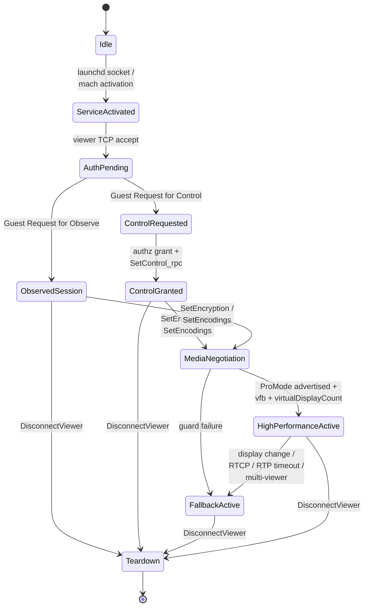

# Session State Machine

The lifecycle of a single viewer ↔ server session, from launchd activation through teardown. This page captures the macro-states. The fine-grained dispatcher state inside `screensharingd::sub_100013900` is documented per security type in [../02-auth/](../02-auth/), and the HP gates are in [../05-high-performance/acceleration-gates.md](../05-high-performance/acceleration-gates.md).

## States

## State Reference

| State | Marker / signature | Notes |
|---|---|---|
| `Idle` | (no process listening) | `screensharingd` not yet activated. |
| `ServiceActivated` | launchd has bound `:5900` / Mach service | Process exists, waiting for a viewer connection. |
| `AuthPending` | server log `Connection accepted :: Viewer Address ...` | TCP accept done; per-viewer state struct allocated. Auth-method dispatch follows. |
| `ObservedSession` | server log `Guest Request for Observe` | Read-only screen sharing. |
| `ControlRequested` | server log `Guest Request for Control` | Awaiting authorization decision. |
| `ControlGranted` | `AuthorizeTheViewerUsingUID` success + `agent_SSAgent_SetControl_rpc` | Pointer / keyboard input accepted by the agent. |
| `MediaNegotiation` | `HandleModifySession`, `HandleCodecChanged`, `SetEncodings` carrying Apple-private encodings | Codec / framerate negotiation; encoding-tier choice (see [../05-high-performance/encoding-tiers.md](../05-high-performance/encoding-tiers.md)). |
| `HighPerformanceActive` | server log `ProMode also enabled on viewer`, `sent RFBMediaStreamMessage1Encoding` | All three gates (vfb, ProMode, virtualDisplayCount) passed. UDP media path may activate. |
| `FallbackActive` | server log `session not accelerated %d`, `connectionDoesNotSupportProMode`, `Release UDP Streaming` | One or more gates failed; TCP framebuffer path continues. |
| `Teardown` | `DisconnectViewer`, `DisconnectViewersSilently`, `No viewers so time to exit` | Cleanup; process may exit if no other viewers. |

## Transitions

### `Idle → ServiceActivated`

- **Trigger**: launchd socket / mach activation for `com.apple.screensharing` or one of the agent mach services.
- **Guards**: service enabled and the launch event has fired (Bonjour `rfb`, mach service request, or IDS launch notification).
- **Evidence**: [component-map.md](component-map.md) "Launchd / Activation Chain".

### `ServiceActivated → AuthPending`

- **Trigger**: viewer TCP connection accepted on `:5900`.
- **Guards**: listener socket / mach endpoint active.
- **Evidence**: `screensharingd::sub_100013900` (`HandleViewerAuthenticationMessage`) is the entry point for the new per-viewer state.

### `AuthPending → ObservedSession`

- **Trigger**: observe flow accepted; server logs `Guest Request for Observe`.
- **Guards**: authz checks pass (user / policy).

### `AuthPending → ControlRequested`

- **Trigger**: explicit control request; server logs `Guest Request for Control`.

### `ControlRequested → ControlGranted`

- **Trigger**: authorization grant + RPC propagation.
- **Guards**: user / policy permission.
- **Evidence**: `AuthorizeTheViewerUsingUID` returns success, then `agent_SSAgent_SetControl_rpc` is called.

### `ControlGranted | ObservedSession → MediaNegotiation`

- **Trigger**: post-auth `SetEncryption` / `SetMode` / `SetDisplayConfiguration` / `SetEncodings` (see [../03-transport/startup-sequence.md](../03-transport/startup-sequence.md)).
- **Evidence**: `HandleModifySession`, `HandleCodecChanged`, `SetEncodings` carrying one of the Apple-private encodings (`0x3e8`–`0x3f3`).

### `MediaNegotiation → HighPerformanceActive`

- **Trigger candidates** (all required):
  - Client advertises `0x3f2` in `SetEncodings` (ProMode gate).
  - `kCGDisplayIsVirtualDevice` returns true (`vfb=1` gate).
  - `display_count > 0` in `SetDisplayConfiguration` (`virtualDisplayCount` gate).
  - UDP stream setup succeeds (`supports60FPS`, HEVC max framerate checks).
  - Framework agreement (`doesServerSupportProMode` + app / delegate pro-mode intent).
- **Evidence**: `SSUDPSender` methods with `supports60FPS`, `GetHEVCEncoderMaxSupportedFrameRate`, `ProMode active` strings, framework cache selectors. See [../05-high-performance/acceleration-gates.md](../05-high-performance/acceleration-gates.md) for the three-gate model.

### `MediaNegotiation → FallbackActive`

- **Trigger candidates** (any sufficient):
  - Session acceleration unavailable (`session not accelerated %d`).
  - Connection-level pro-mode incompatibility (`connectionDoesNotSupportProMode`).
  - UDP setup / health failure (`UDP connect failed`, RTP / RTCP timeout).
  - Multi-viewer condition (`2 or more viewers`).
  - Explicit non-active state (`ProMode not active`).

### `HighPerformanceActive → FallbackActive`

- **Trigger candidates**:
  - Display / session change (`ProMode active - called release due to display change`).
  - Explicit release (`Release UDP Streaming viewerID`).

### `* → Teardown`

- **Trigger**: disconnect / server termination.
- **Evidence**: `DisconnectViewer`, `DisconnectViewersSilently`, `No viewers so time to exit`, `streamDidStop`.

## Confidence

| Aspect | Confidence | Evidence type |
|---|---|---|
| Observe vs control request separation | `confirmed` | static strings + runtime logs |
| Auth / authz gating stage exists | `confirmed` | static dispatcher in `sub_100013900` |
| UDP HP media branch exists and has a release path | `confirmed` | static class hierarchy + strings |
| Multi-viewer branch exists | `confirmed` | static string `2 or more viewers, send list again to the menu extra` |
| Exact guard ordering for HP promotion | `strong-inference` | three-gate model in [../05-high-performance/acceleration-gates.md](../05-high-performance/acceleration-gates.md) is structurally resolved, but runtime ordering under concurrent triggers is not exhaustively verified |
| Downgrade precedence under concurrent triggers (timeout + second viewer + policy) | `open` | needs targeted runtime trace |

## See Also

- Auth dispatcher (`AuthPending` internals): [../02-auth/overview.md](../02-auth/overview.md)
- Static guard catalogue for `MediaNegotiation → HighPerformanceActive`: [../05-high-performance/static-guard-matrix.md](../05-high-performance/static-guard-matrix.md)
- The runtime decision points that hold the three-gate model: [../05-high-performance/acceleration-gates.md](../05-high-performance/acceleration-gates.md)
- Where `MediaNegotiation` chooses an encoding tier: [../05-high-performance/encoding-tiers.md](../05-high-performance/encoding-tiers.md)
- Process and IPC topology: [component-map.md](component-map.md)
