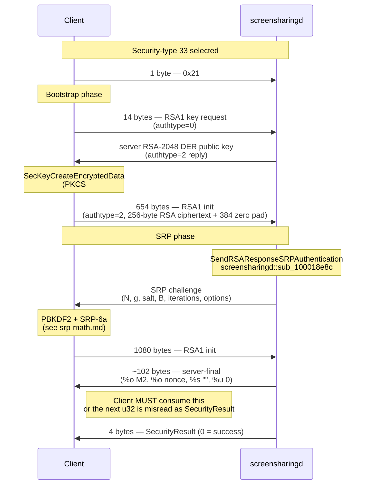
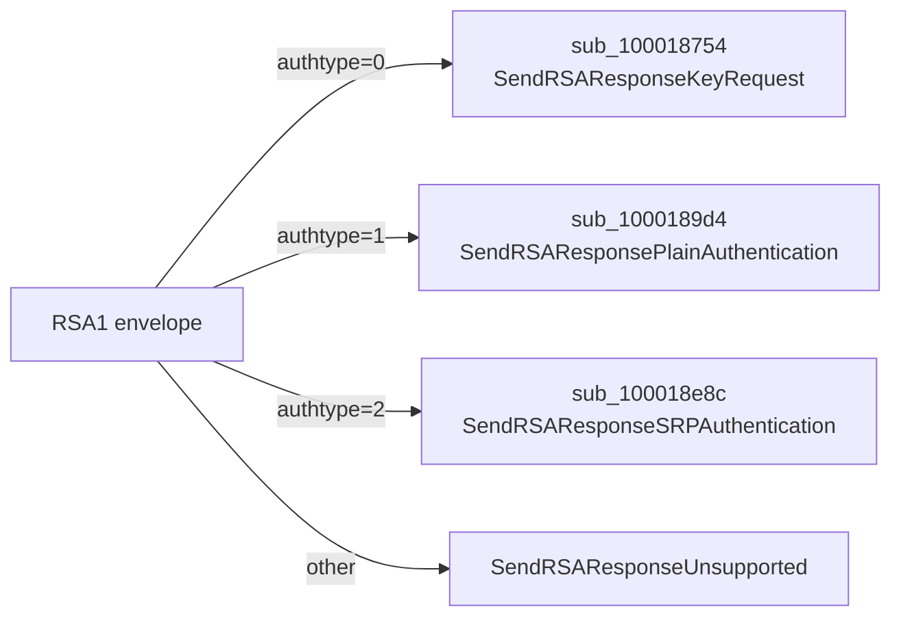

# Type 33 — RSA-SRP (Bootstrap Then SRP)

| | |
|---|---|
| Wire ID | `33` (`0x21`) |
| Symbol | `rfbAppleAuthRSA_SRP` ([`include/rfb/rfbproto.h:304`](../../include/rfb/rfbproto.h)) |
| Status | `confirmed` — full end-to-end standalone implementation works against the live server |
| Cryptographic profile | RSA-2048 wrap (PKCS#1 v1.5) → RFC-5054 SRP-6a with SHA-512 / PBKDF2 |
| macOS-only on client | yes — RSA via `Security.framework` (`SecKeyCreateEncryptedData`) |

Apple's RSA-SRP scheme has two phases: an RSA-wrapped **bootstrap** that hands the server the username inside an RSA-PKCS#1 envelope, and a standard RFC-5054 SRP exchange immediately afterwards. The shared SRP math is on [srp-math.md](srp-math.md); this page covers the RSA1 wire framing that surrounds it.

## Sequence



## RSA1 Envelope

All four type-33 packets share the same outer wrapping. The dispatcher on the server (`screensharingd::sub_100015bb8`, `SendRSAResponse`) parses the inner `authtype` and routes to one of four sub-handlers:



### Envelope layout

| Offset | Size | Field | Notes |
|---|---|---|---|
| `0` | 4 | `total_len` | `u32` BE; payload length after this field |
| `4` | 2 | `packet_version` | `u16` BE; always `0x0100` |
| `6` | 4 | `magic` | ASCII `"RSA1"` |
| `10` | 2 | `authtype` | `u16` BE; `0`=KeyRequest, `1`=PlainAuth, `2`=SRP |
| `12` | 2 | `aux` | `u16` BE; length of the inner payload that follows (or `0x0100` for key request) |
| `14` | `aux` (or fixed) | `body` | per-authtype payload |
| ... | (padding) | trailing zero bytes (see below) | |

### authtype dispatch (`screensharingd::sub_100015bdc`)

| authtype | Server handler | Purpose |
|---|---|---|
| `0` | `screensharingd::sub_100018754` (`SendRSAResponseKeyRequest`) | hands client the server's RSA public key |
| `1` | `screensharingd::sub_1000189d4` (`SendRSAResponsePlainAuthentication`) | plain-password path (not used by native client) |
| `2` | `screensharingd::sub_100018e8c` (`SendRSAResponseSRPAuthentication`) | SRP step-1 or step-2 |

## Bootstrap Phase

### Packet 1 — Client key request (14 bytes total, `authtype=0`)

| Offset | Size | Value | Field |
|---|---|---|---|
| `0` | 4 | `0x0000000a` | total_len = 10 |
| `4` | 2 | `0x0100` | packet_version |
| `6` | 4 | `"RSA1"` | magic |
| `10` | 4 | zero pad | (authtype field is implicitly 0 since the body is empty) |

Builder: `build_auth33_rsa1_key_request_packet` ([`src/libvncclient/ard.c:388-396`](../../src/libvncclient/ard.c)).

### Packet 2 — Server type-0 reply (variable, typically 301 bytes)

| Offset | Size | Field | Notes |
|---|---|---|---|
| `0` | 4 | `total_len` | `u32` BE |
| `4` | 2 | `packet_version` | `0x0001` |
| `6` | 4 | `der_len` | `u32` BE; observed `294` for RSA-2048 |
| `10` | `der_len` | DER `SubjectPublicKeyInfo` | RSA-2048, exponent `65537` |

### Packet 3 — Client RSA-wrapped init (654 bytes, `authtype=2`)

The plaintext that gets RSA-encrypted is built by `build_auth33_init_plaintext` ([`src/libvncclient/ard.c:413-436`](../../src/libvncclient/ard.c)) and has the shape `u32_be payloadLen || %s("") || %s(username) || %s("") || %o(empty)`, where `%s` is `u16_be length || bytes` and `%o` is `u8 length || bytes`. For a 4-byte ASCII username (e.g. `user`), the plaintext is:

```
0000000b 0000 0004 75736572 0000 00
^len=11  ^""  ^4   ^"user"  ^""  ^%o len=0
```

The plaintext is 15 bytes total. It is encrypted with RSA-2048 PKCS#1 v1.5 against the server's DER public key, producing 256 ciphertext bytes. The full on-wire packet:

| Offset | Size | Field |
|---|---|---|
| `0` | 4 | `total_len = 650` (`u32` BE `0x0000028a`) |
| `4` | 2 | `packet_version = 0x0100` |
| `6` | 4 | `magic = "RSA1"` |
| `10` | 2 | `authtype = 0x0002` |
| `12` | 2 | `aux = 0x0100` (256) |
| `14` | 256 | RSA-2048 ciphertext of the plaintext above |
| `270` | 384 | zero pad |

The 384 trailing bytes outside `aux` are not consumed by the server.

Builders: `build_auth33_rsa1_init_packet` ([`src/libvncclient/ard.c:398-411`](../../src/libvncclient/ard.c)) and `build_auth33_init_key_material` ([`src/libvncclient/ard.c:457-541`](../../src/libvncclient/ard.c)). The RSA encryption uses `SecKeyCreateEncryptedData(key, kSecKeyAlgorithmRSAEncryptionPKCS1, plaintext, ...)`.

## SRP Phase

### Packet 4 — Server SRP challenge

The challenge body parses as the standard SRP token sequence at offset `+10` (after the RSA1 header):

```
%c %m %m %o %m %q %s
^  ^  ^  ^  ^  ^  ^
|  |  |  |  |  |  options (e.g. "mda=SHA-512,replay_detection,...")
|  |  |  |  |  iterations (u64 BE, e.g. 156250)
|  |  |  |  B (server SRP public key, 512 bytes for 4096-bit group)
|  |  |  salt (32 bytes)
|  |  g (1 byte, value 0x05)
|  N (RFC-5054 4096-bit safe prime)
0x00 (version)
```

See [srp-math.md](srp-math.md) for the full parameter table.

### Packet 5 — Client SRP response (1080 bytes, `authtype=2`)

| Offset | Size | Field |
|---|---|---|
| `0` | 4 | `total_len = 1076` |
| `4` | 2 | `packet_version = 0x0100` |
| `6` | 4 | `magic = "RSA1"` |
| `10` | 2 | `authtype = 0x0002` |
| `12` | 2 | `aux = 0x02aa` (682) |
| `14` | 2 | reserved `u16 0x0000` |
| `16` | 2 | `inner_len = 0x02a6` (678) |
| `18` | 678 | SRP inner payload: `%m %o %s %o` (A, M1, options, 16-byte nonce) |
| `696` | 384 | trailing pad |

The 384-byte tail is allocator residue from the native client's send buffer (`Shared Screen Viewer::sub_1000f54fa` mallocs the buffer and never explicitly initializes those bytes for `authtype=2`). The server consumes only `aux` bytes, so the tail content does not matter — zero-fill is accepted.

Builder: `auth33_build_packet2_candidate` ([`src/libvncclient/ard.c:801-840`](../../src/libvncclient/ard.c)) wrapping `auth33_build_step2_inner` ([`src/libvncclient/ard.c:543-799`](../../src/libvncclient/ard.c)).

### Packet 6 — Server-final (~102 bytes)

Parsed as `%o %o %s %u` (server-side format string per `screensharingd::sub_10001024e`):

| Token | Size | Meaning |
|---|---|---|
| `%o` | 64 | server's `M2` proof |
| `%o` | 16 | post-auth side field |
| `%s` | 0 | reserved (empty) |
| `%u` | 4 | reserved (`0`) |

**This packet sits between the SRP step-2 and `SecurityResult`.** A naïve libvncclient implementation will read its first 4 bytes as the `SecurityResult` and fail; the standalone client must consume it explicitly. See `maybe_consume_auth33_server_final` ([`src/libvncclient/ard.c:137-159`](../../src/libvncclient/ard.c)).

## Session Key

After `M1` is verified, both sides derive `session_key = SHA-256(K)[0:16]` where `K = SHA-512(PAD(S))`. The client stores it at `client->ardSessionKey`; the server installs it via `SetupAESKeys` (`screensharingd::sub_100016fb8`) into the four `CCCryptorRef` objects used by the post-auth layer. See [srp-math.md](srp-math.md) for the derivation and [../03-transport/startup-sequence.md](../03-transport/startup-sequence.md) for what happens next.

## Code Anchors

| Side | Symbol / Location |
|---|---|
| Client dispatcher | `rfbClientHandleARDAuth` → `HandleARDAuth33` ([`src/libvncclient/ard.c:842-912`](../../src/libvncclient/ard.c)) |
| Client SRP math | `auth33_build_step2_inner` ([`src/libvncclient/ard.c:543-799`](../../src/libvncclient/ard.c)) |
| Client RSA wrap | `build_auth33_init_key_material` ([`src/libvncclient/ard.c:457-541`](../../src/libvncclient/ard.c)), macOS-only |
| Client server-final guard | `maybe_consume_auth33_server_final` ([`src/libvncclient/ard.c:137-159`](../../src/libvncclient/ard.c)) |
| Server entry | `screensharingd::sub_100015bb8` (`SendRSAResponse`) |
| Server RSA1 dispatch | `screensharingd::sub_100015bdc` |
| Server authtype=2 handler | `screensharingd::sub_100018e8c` (`SendRSAResponseSRPAuthentication`) |
| Server post-auth state | state-`0xa` branch in `screensharingd::sub_100013900` |
| Server log label | `"RSA-SRP"` when `viewer[0x426].w == 2`, else `"RSA"` — `screensharingd::sub_10005ab30 @ 0x10005ad98` |
| Server runtime key install | `screensharingd::sub_100016fb8` (`SetupAESKeys`); SHA-256 callsite at `0x100019260` |

## Standalone Implementation

The standalone client in [`examples/client/applehpdebug.c`](../../examples/client/applehpdebug.c) authenticates against `<server-ip>:5900` without using the native Screen Sharing viewer as a packet oracle. The minimum environment to drive it is:

```bash
export VNC_USER='testuser'
export VNC_PASS='changeme'
export VNC_AUTH_SCHEMES='33'
```

The historical helper-based path (where a Python script generated packet-2 from a saved challenge) is still supported via `VNC_AUTH33_HELPER` and `VNC_AUTH33_REPLAY` but is no longer required — packet-1 and packet-2 are both generated in-process. The helper script at [`../06-tooling/scripts/screensharing_tools.py`](../06-tooling/scripts/screensharing_tools.py) remains for debugging.

Successful run produces:

- Client: `auth33: sending helper-generated response`, then `auth33: consumed intermediate server-final packet (98 bytes)`, then `VNC authentication succeeded`.
- Server: `Authentication: SUCCEEDED :: User Name: testuser :: Viewer Address: <server-ip> :: Type: RSA-SRP`.

## Open Items

- The exact semantic role of the 16-byte side fields (one in the client step-2 trailing `%o`, one in the server-final `%o`) beyond their role in post-auth security-layer initialization.
- Whether the `authtype=1` plain-password path (`screensharingd::sub_1000189d4`) is ever taken in practice — no observed capture uses it.
