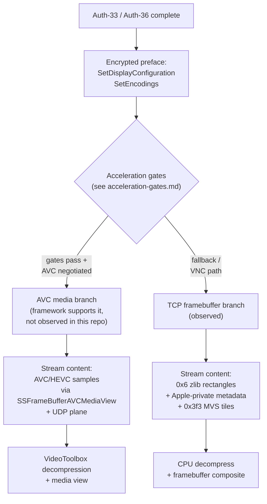

# Video Pipeline: What's Actually On The Wire

There are two distinct content paths inside Screen Sharing: a low-latency **TCP framebuffer path** that the saved native HP capture in this repo actually exercised, and an **AVC media path** that the viewer framework supports but that no capture in this repo has hit. This page draws the line between them, lists the byte-level evidence for the TCP path, and identifies what's known and unknown about the media path.

For session-state context see [acceleration-gates.md](acceleration-gates.md); for the encoding-tier negotiation see [encoding-tiers.md](encoding-tiers.md).

## The Two Paths

Both paths can be "high-performance" in product terms — the TCP branch achieves low latency through virtual-display state and dynamic resolution, not through hardware video decode. The two are not synonyms.

## What's In The Observed TCP Stream

Decoding the saved native HP transport trace, the post-auth content stream is dominated by classical RFB rectangles plus Apple-private metadata. Counts are approximate (varies per capture) and use encoding IDs from [../03-transport/message-catalog.md](../03-transport/message-catalog.md):

| Encoding | Wire ID | Role | Frequency in observed trace |
|---|---|---|---|
| `Zlib` framebuffer | `0x6` | the bulk of screen content | dominant |
| `CursorImage` | `0x450` | cursor bitmap / hotspot | per cursor change |
| `AppleDisplayLayout` | `0x451` | display geometry, including dynamic resize | per resize event |
| `VendorKeysymEncoding` | `0x453` | keysym mapping advertisement | once early |
| `KeyboardInputSource` | `0x455` | active keyboard layout | once early, then on change |
| `DeviceInfo` | `0x456` | device identifier / model | once early |
| `RFBMediaStreamMessage1` | `0x3f2` | ProMode media-init announcement | once when ProMode advertised |

What the observed trace does **not** carry:

- No `rfbEncodingH264`.
- No Annex-B start codes (`00 00 00 01`) that survive payload inspection — apparent matches collapse into ordinary zlib or control bytes.
- No AVCC / HVCC parameter-set extradata structures.
- No payload family that resembles a compressed video bitstream being handed to a hardware decoder.

Conclusion: the observed native HP session reaches the virtual-display state and emits ProMode media-init signaling, but the actual screen content is decompressed on the CPU as classical zlib framebuffer rectangles. The viewer renders it through the normal `SSFrameBufferView` path, not the AVC media view.

## What The Viewer Framework Could Do

The framework binaries make it clear that a real compressed-media path exists, even though this repo has not yet captured it active.

| Symbol | Implication |
|---|---|
| `SSFrameBufferAVCMediaView` (Objective-C class) | A distinct framebuffer-view subclass for AVC media. `-[SSFrameBufferAVCMediaView isUsingAVCMediaStream]` returns `1`; `-[SSFrameBufferView isUsingAVCMediaStream]` and `-[SSFrameBufferAVConferenceView isUsingAVCMediaStream]` both return `0`. |
| `+[SSSession udpSocketWithAVCMediaStreamConfig:port:]` | A distinct UDP media transport setup, separate from the framebuffer socket. |
| `_GetHEVCDecoderMaxSupportedFrameRate` | Real capability query: creates a `CMVideoFormatDescription`, attempts `VTDecompressionSessionCreate`, queries `kVTPropertyTypeNumber` decoder throughput, computes per-stream framerate ceilings. Not cosmetic. |
| Server-side `VTCompressionSessionCreate` in `screensharingd` | Server can produce encoded video samples. |
| `SSUDPSender ... supports60FPS ...` (`ScreensharingAgent`) | UDP media stream setup with high-FPS gating. |

The viewer's `-[SSSessionView dynamicResolutionModeAvailable]` predicate requires all three of:

1. `frameBufferView.isUsingAVCMediaStream`
2. `self.isUsingVirtualDisplay`
3. `frameBufferView.frameBuffer.screenConfiguration.screens.count == 1`

The first gate is the decisive one for the working VNC session: only the `SSFrameBufferAVCMediaView` subclass returns true. In every captured VNC session the viewer instantiated the base `SSFrameBufferView`, not the AVC subclass, so dynamic-resolution mode could never engage despite the other two conditions being satisfied. Detailed viewer-side analysis: [viewer-track-24G419.md](viewer-track-24G419.md).

## What This Means For The Standalone Client

If the goal is to match observed native HP behaviour, a `libvncclient`-based standalone client **does not need GPU video-decode code**. The work it actually needs is:

- Correct `SetDisplayConfiguration` body, including the virtual-display fields.
- Efficient zlib throughput for `0x6` framebuffer rectangles.
- Handlers for `0x450`, `0x451`, `0x453`, `0x455`, `0x456` (consumed as `FramebufferUpdate` rectangles, not standalone messages).
- Dynamic framebuffer resize on every `0x451 AppleDisplayLayout`.
- Suppression of redundant `0x03 FramebufferUpdateRequest` polling once `0x09 AutoFrameBufferUpdate` is active.
- Optionally `0x3f3` multi-variant codec decoding for higher-quality content (see [encoding-tiers.md](encoding-tiers.md)).

VideoToolbox / AVC decoding becomes relevant only when a future capture or runtime branch actually delivers AVC/HEVC samples — at which point the open questions below need to be resolved first.

## Open Questions

- What exact runtime condition causes the viewer to instantiate `SSFrameBufferAVCMediaView` instead of `SSFrameBufferView`? Candidate inputs include topology (machine/VNC vs Apple ID), transport class (TCP vs quick-relay), explicit codec negotiation, and saved per-host preferences.
- Can a machine/VNC session ever carry AVC/HEVC content over TCP without using the dedicated UDP media plane?
- Whether the `0x3f2 RFBMediaStreamMessage1` announcement is followed by real UDP media in any session — the observed announcements describe ports `5900`/`5901` but no UDP traffic appears on those ports in the saved capture.

These questions are tracked in [../08-tracking/open-questions.md](../08-tracking/open-questions.md).

## See Also

- Encoding-tier negotiation that picks zlib vs `0x3f3` vs `0x3ea`: [encoding-tiers.md](encoding-tiers.md)
- Three-gate acceleration model: [acceleration-gates.md](acceleration-gates.md)
- Apple-private rectangle wire formats: [../03-transport/message-catalog.md](../03-transport/message-catalog.md)
- Viewer-side AVC class hierarchy: [viewer-track-24G419.md](viewer-track-24G419.md)
- Architecture overview: [../01-architecture/component-map.md](../01-architecture/component-map.md)
