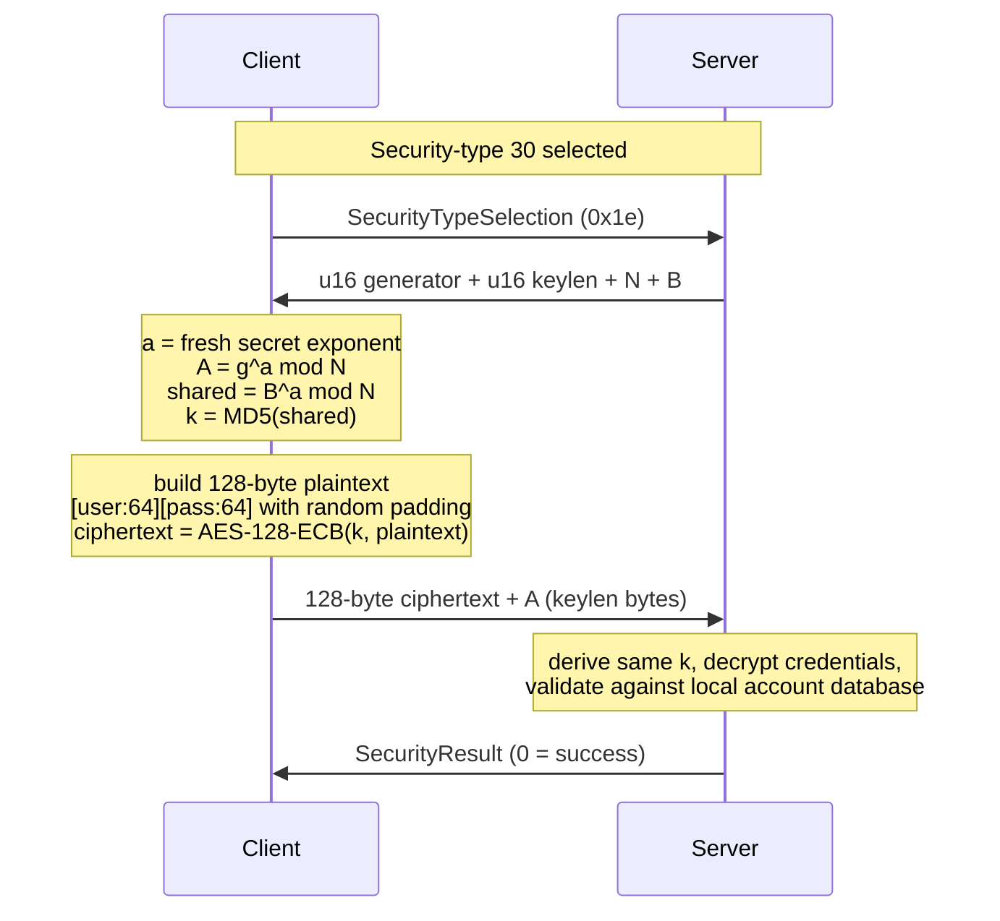
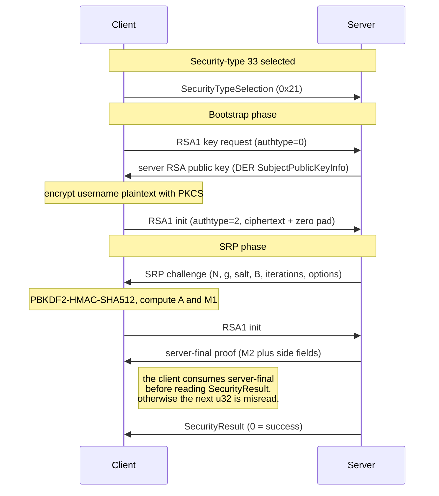
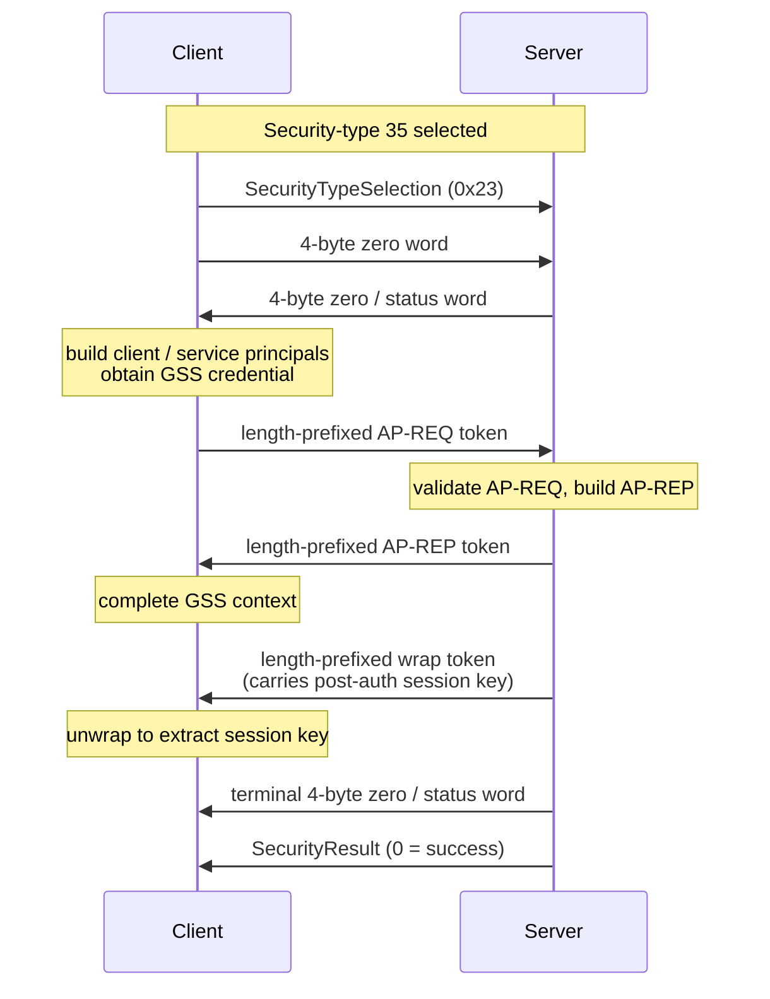
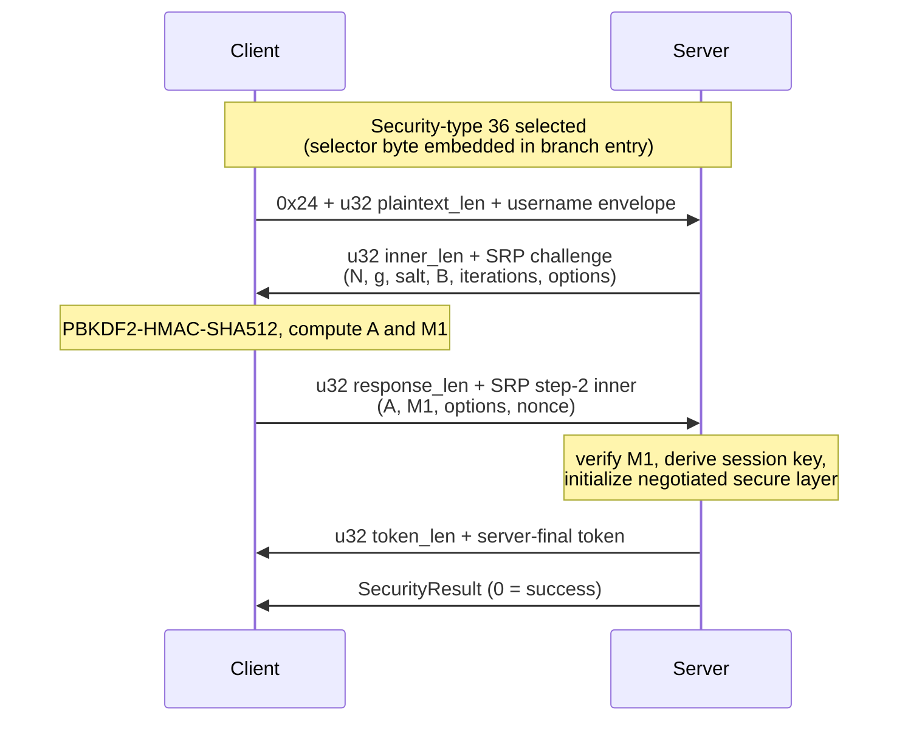
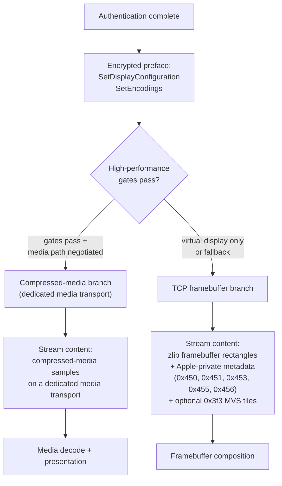

# Apple VNC High-Performance Extension

## Status of This Memo

This document defines the currently specified Apple VNC high-performance session model for the `24G231` baseline.

This memo is written in the style of a protocol specification. It defines the interoperable behavior for the current revision. Where details remain incomplete, this document marks them as revision gaps or implementation-defined behavior rather than leaving the primary protocol narrative ambiguous.

## Abstract

This document specifies an Apple-specific extension layered on top of the Remote Framebuffer protocol. The extension defines:

- multiple Apple authentication branches selected by security type, including `30` (Diffie-Hellman), `33` (`RSA1` / `RSA-SRP`), `35` (Kerberos GSS-API), and `36` (direct SRP)
- a post-auth rekey message that transitions the session into an encrypted record layer
- a display-session configuration model based on vendor-specific control messages
- vendor-specific framebuffer-update encodings carrying layout, cursor, keyboard, device, and media-init information
- a high-performance session model that includes virtual-display behavior and optional media-path negotiation

The currently specified subset is sufficient for a conforming client to authenticate, establish the encrypted transport, configure the display session, process the initial vendor-specific metadata burst, and sustain a functioning framebuffer session.

## 1. Introduction

The Apple VNC high-performance extension augments a standard RFB session with Apple-specific authentication branches, encrypted control transport, display configuration, and high-performance session behavior.

The extension is not a replacement for RFB. It is layered on top of standard RFB version negotiation and framebuffer semantics, while introducing additional control and metadata flows required for Apple-compatible session behavior.

Authentication branch selection and high-performance mode are distinct protocol concerns. Authentication determines how the session is established; high-performance mode, virtual-display behavior, and media-path negotiation are later session properties and MUST NOT be inferred solely from the selected authentication branch. In particular, high-performance sessions are not exclusive to any single authentication type, and observed behavior includes high-performance sessions established through type `30`.

This document is the canonical protocol description for the project. Supporting documents MAY provide reference tables, implementation notes, archive material, or revision tracking, but they do not supersede the definitions stated here.

## 2. Conventions and Terminology

The key words "MUST", "MUST NOT", "REQUIRED", "SHALL", "SHALL NOT", "SHOULD", "SHOULD NOT", "RECOMMENDED", "MAY", and "OPTIONAL" in this document are to be interpreted as described in RFC 2119 and RFC 8174.

The following terms are used throughout this document:

- `client`: the initiating viewer endpoint
- `server`: the remote screen-sharing endpoint
- `record layer`: the encrypted transport used after the rekey message
- `prelude`: the cleartext client messages sent after authentication and before rekeyed control traffic begins
- `encrypted preface`: the first encrypted client messages sent immediately after record-layer enablement
- `virtual display`: a session model in which the server presents a logical display space managed through vendor-specific configuration and layout messages
- `high-performance mode`: the Apple-specific session mode associated with lower-latency display handling and optional media-path behavior
- `revision gap`: a protocol area intentionally marked as not fully specified in this revision

Unless otherwise stated, multi-byte integer fields are encoded in network byte order.

### 2.1 Variable-Length Grammar Atoms

The authentication section uses the following variable-length atoms:

- `%m`: `u16 length || byte[length] value`
- `%o`: `u8 length || byte[length] value`
- `%s`: `u16 length || byte[length] utf8_string`
- `%q`: `u64 value`
- `%u`: `u32 value`

These atoms are part of the maintained grammar notation for auth type `33`.

## 3. Protocol Stages and Session Model

### 3.1 Protocol Stages

An Apple VNC high-performance session proceeds in the following phases:

1. RFB version negotiation
2. security-type selection
3. selected authentication branch
4. `SecurityResult`
5. `ClientInit` and `ServerInit`
6. cleartext Apple prelude
7. rekey by `EncodeEncryptionInfo`
8. encrypted preface
9. vendor-specific metadata exchange
10. steady-state framebuffer, control, and optional high-performance behavior

The extension is layered on standard RFB framing. Several Apple-specific behaviors are expressed either as client-to-server control messages or as server-to-client framebuffer-update rectangle encodings.

### 3.2 Stage Separation

For the purposes of this specification, the protocol is divided into the following major stages:

- `handshake stage`: from the first `ProtocolVersion` frame through completed authentication and `SecurityResult`
- `session bootstrap stage`: `ClientInit`, `ServerInit`, and the Apple cleartext prelude
- `secure transport stage`: rekey, encrypted preface, metadata exchange, and steady-state session traffic

This document treats the handshake stage and the secure transport stage as distinct protocol layers.

### 3.3 Connection and Handshake Overview

The following diagram illustrates the common session outline from TCP establishment through completed authentication:

```text
Client                                                   Server
  |--------------- TCP SYN -------------------------------->|
  |<-------------- TCP SYN-ACK -----------------------------|
  |--------------- TCP ACK -------------------------------->|
  |                                                         |
  |<-------------- ProtocolVersion -------------------------|
  |---------------- ProtocolVersion ----------------------->|
  |<-------------- SecurityTypes ---------------------------|
  |---------------- SecurityTypeSelection ----------------->|
  |=============== selected auth branch ===================>|
  |<--------------- SecurityResult -------------------------|
```

Frame summary:

| Step | Direction | Message | Carries |
|---|---|---|---|
| 1 | Client -> Server | `TCP SYN` | TCP connection open |
| 2 | Server -> Client | `TCP SYN-ACK` | TCP connection open acknowledgement |
| 3 | Client -> Server | `TCP ACK` | TCP connection established |
| 4 | Server -> Client | `ProtocolVersion` | version string |
| 5 | Client -> Server | `ProtocolVersion` | version string |
| 6 | Server -> Client | `SecurityTypes` | count, security types |
| 7 | Client -> Server | `SecurityTypeSelection` | selected security type |
| 8 | Client <-> Server | selected authentication branch | branch-specific authentication traffic |
| 9 | Server -> Client | `SecurityResult` | result, when emitted by the selected branch |

Notes:

- the TCP three-step establishment is shown only as transport context and is not specified further by this document
- the first protocol frame after TCP establishment is `ProtocolVersion` from the server
- the first client-originated authentication frame is `SecurityTypeSelection`
- high-performance mode is not part of the common handshake and MUST NOT be inferred from the selected authentication branch
- auth type `30` is also compatible with later high-performance session behavior

### 3.4 Session Roles

The protocol defines a client that requests and renders a remote session and a server that authorizes the client, manages session state, and emits framebuffer and metadata updates.

### 3.5 Session Classes

This revision recognizes at least the following session behaviors:

- standard framebuffer session
- virtual-display framebuffer session
- high-performance session with media-init signaling

A high-performance session MUST NOT be assumed to carry compressed media samples solely because high-performance mode is active. In this revision, high-performance state and media-content transport are treated as related but distinct concerns.

### 3.6 Observe and Control

The protocol supports distinct observe and control paths. The normal control path uses `SetModeMessage(mode=1)` during session bootstrap. Stronger control variations MAY exist, but they are not fully specified in this revision.

### 3.7 RFB Version

The active protocol baseline uses `RFB 003.889`.

### 3.8 Capability Signaling Overview

The client advertises capability through:

- protocol version (§3.7)
- `ClientInit` (§5.2)
- `ViewerInfo` (§5.5)
- `SetEncodings` (§8.1)

The exact full semantics of all capability bits are not fully specified in this revision. A conforming implementation SHOULD preserve the maintained startup ordering and capability advertisement strategy defined in this document.

## 4. Handshake and Authentication

### 4.1 Handshake

#### 4.1.1 Overview

The common handshake sequence from the first frame through authentication-branch selection is:

```text
Client                                              Server
  |                                                   |
  |<---------------- ProtocolVersion -----------------|
  |----------------- ProtocolVersion ---------------->|
  |<---------------- SecurityTypes -------------------|
  |---------------- SecurityTypeSelection ----------->|
  |=============== enter selected auth flow ==========>|
  |                                                   |
```

After `SecurityTypeSelection`, the connection enters the authentication flow bound to the selected security type. The later high-performance session state is negotiated after authentication and session initialization and is not defined by the authentication branch alone.

#### 4.1.2 Common Handshake Frame Sequence

The common handshake stage contains the following ordered messages:

1. server `ProtocolVersion`
2. client `ProtocolVersion`
3. server security-type list
4. client security-type selection

The messages after step 4 are branch-specific.

#### 4.1.3 ProtocolVersion

The maintained `ProtocolVersion` frame is the standard 12-byte RFB banner:

```text
char[12] "RFB 003.889\n"
```

Frame diagram:

```text
0                   1                   2
0 1 2 3 4 5 6 7 8 9 0 1
+-+-+-+-+-+-+-+-+-+-+-+-+
|R|F|B| |0|0|3|.|8|8|9|\n|
+-+-+-+-+-+-+-+-+-+-+-+-+
```

Offset and range:

| Offset | Size | Field | Range / Value |
|---:|---:|---|---|
| `0` | `12` | `protocol_version` | ASCII `RFB 003.889\n` |

Bit-level interpretation:

- all 12 bytes are ASCII
- no sub-byte fields are defined

#### 4.1.4 Security-Type Advertisement

The security-type list is the standard RFB form:

```text
u8      security_type_count
u8[]    security_types
```

Frame diagram:

```text
0                   1                   2                   3                   4
+-------------------+-------------------+-------------------+-------------------+-------------------+
| security_type_cnt | security_type[0]  | security_type[1]  | security_type[2]  | security_type[3]  |
+-------------------+-------------------+-------------------+-------------------+-------------------+
```

Offset and range:

| Offset | Size | Field | Range / Value |
|---:|---:|---|---|
| `0` | `1` | `security_type_count` | active baseline `4` |
| `1` | `1` | `security_type[0]` | active baseline `30` |
| `2` | `1` | `security_type[1]` | active baseline `33` |
| `3` | `1` | `security_type[2]` | active baseline `36` |
| `4` | `1` | `security_type[3]` | active baseline `35` |

The active baseline advertises:

- `30`
- `33`
- `36`
- `35`

This advertisement does not imply that all sessions use the same authentication branch. The selected security type determines the authentication flow that follows.

#### 4.1.5 Security-Type Selection

The baseline protocol selection frame is one byte, but some security types immediately extend that selection with additional branch-specific bytes. The exact boundary therefore depends on the selected authentication flow.

The shared leading field is:

```text
u8      selected_security_type
```

Frame diagram:

```text
0
+-------------------+
| selected_type     |
+-------------------+
```

Offset and range:

| Offset | Size | Field | Range / Value |
|---:|---:|---|---|
| `0` | `1` | `selected_security_type` | one of the advertised security types |

Maintained selections:

- `0x1e` for auth type `30` (Diffie-Hellman)
- `0x21` for auth type `33` (RSA-SRP)
- `0x23` for auth type `35` (Kerberos GSS-API)
- `0x24` for auth type `36` (Direct SRP)

Branch-specific trailing bytes:

- Type `35` immediately follows the one-byte selector with a 4-byte zero word; see §4.2.5.
- Type `36` does not send the one-byte selector by itself: the byte `0x24` is the first byte of the type-36 branch-entry packet (§4.2.6). A client SHOULD NOT emit a standalone `0x24` followed by a separate type-36 branch-entry packet; the `0x24` is the first byte of the branch entry.
- Types `30` and `33` send the bare one-byte selector and then enter their branch-specific exchange (§4.2.3 and §4.2.4 respectively).

### 4.2 Authentication

#### 4.2.1 Flow Registry

The currently maintained security-type registry is:

| Security Type | Provisional Name | Current status |
| ---: | --- | --- |
| `30` | `DH` | Diffie-Hellman / username-password path; specified in §4.2.3 |
| `31` | `Guest Observe` | guest observe path |
| `32` | `Guest Control` | guest control path |
| `33` | `RSA / RSA-SRP` | primary maintained wire specification; §4.2.4 |
| `34` | `TBD` | not yet identified in this revision |
| `35` | `Kerberos GSS-API` | supported by on-wire `AP-REQ` / `AP-REP` / wrap-token evidence; §4.2.5 |
| `36` | `Direct SRP` | direct SRP mech path with negotiated secure layer; §4.2.6 |

Important notes:

- `34` remains unspecified in this revision.
- the type-35 capture does not use the known type-33 `RSA1` envelope.
- the type-35 capture carries Kerberos V5 GSS-API tokens on wire.
- the type-36 branch is a direct SRP path with RFC5054-4096 / SHA-512 / PBKDF2 semantics and a negotiated secure layer that includes `ChaCha20-Poly1305`.
- this document currently specifies the type-33 branch in depth and records type-35 and type-36 as separate branches.

#### 4.2.2 Authentication Branches

This specification distinguishes multiple authentication branches selected by the RFB security-type negotiation. Per-branch flows are specified in the subsections that follow, in numeric order of the security-type identifier.

Figure 4.2-1 illustrates the master selection across the four specified branches:


The server commits to the selected branch and proceeds to the corresponding flow. The four branches share no on-wire envelope; only types `33` and `36` share cryptographic primitives (SRP-6a) but with different framing. Types `31`, `32`, and `34` remain outside the detailed wire scope of this revision.

#### 4.2.3 Type 30: Diffie-Hellman

##### 4.2.3.1 Flow Summary

The maintained type-30 sequence is:

1. select security type `30`
2. receive a server DH challenge announcing generator, modulus, and the server public value
3. encrypt a fixed-size credentials block with a key derived from the DH shared secret
4. send the encrypted credentials block followed by the client DH public value
5. receive `SecurityResult`

Type 30 predates the Apple SRP families and is still advertised by current servers. It is the legacy `Apple Remote Desktop` authentication path.

Figure 4.2.3-1 illustrates the type-30 exchange:



##### 4.2.3.2 Server Challenge

The server emits:

```text
u16     generator
u16     keylen
byte[]  modulus_N         (length = keylen)
byte[]  server_public_B   (length = keylen)
```

The maintained interoperable group is `1024`-bit MODP. The wire fields are big-endian.

##### 4.2.3.3 Client Response

The client computes:

1. fresh secret exponent `a`
2. `A = g^a mod N`
3. `shared = B^a mod N`
4. `k = MD5(shared)`
5. plaintext credentials block:

```text
byte[64]  username   (null-terminated UTF-8, remainder filled with cryptographic random bytes)
byte[64]  password   (null-terminated UTF-8, remainder filled with cryptographic random bytes)
```

6. `ciphertext = AES-128-ECB(k, plaintext)` — exactly 8 blocks of 16 bytes

The client then emits:

```text
byte[128]   ciphertext
byte[]      client_public_A   (length = keylen)
```

##### 4.2.3.4 Cryptographic Profile

- Diffie-Hellman 1024-bit MODP, generator `2` (some servers use `5`)
- key derivation: `key = MD5(shared)` — 16 bytes used as AES-128 key
- record cipher: AES-128-ECB over a fixed 128-byte plaintext

The plaintext padding (random bytes after the null terminators) ensures different sessions produce different ciphertexts even when the same credentials are reused.

##### 4.2.3.5 Authentication Result

The session continues with `ClientInit` and `ServerInit` upon `SecurityResult = 0`. Type 30 does not produce a post-auth session key consumed by the later record layer; the Apple AES-CBC record layer activates only after `EncodeEncryptionInfo` (§6).

#### 4.2.4 Type 33: RSA / RSA-SRP

##### 4.2.4.1 Flow

The maintained type-33 sequence is:

1. select security type `33`
2. send RSA key-request message
3. receive DER public-key response
4. send RSA-SRP initialization packet
5. receive SRP challenge
6. send SRP response packet
7. receive server final proof
8. receive `SecurityResult`

Authentication is complete only after the final proof and `SecurityResult = 0`.

Figure 4.2.4-1 illustrates the type-33 exchange:



##### 4.2.4.2 RSA1 Envelope and Key Exchange

Type `33` uses the `RSA1` envelope:

```text
u32      total_len
u16      version
char[4]  magic = "RSA1"
u16      authtype
u16      aux
byte[]   body
```

Frame diagram:

```text
0                   4       6               10      12
+-------------------+-------+---------------+-------+-------+-------------------...
| total_len         |version| magic="RSA1"  |auth_t | aux   | body
+-------------------+-------+---------------+-------+-------+-------------------...
```

Field semantics:

- `total_len`: payload length after the outer `u32`
- `version`: envelope version; the maintained baseline uses `0x0100` for auth packets
- `magic`: ASCII `RSA1`
- `authtype`: envelope subtype
- `aux`: subtype-specific control or length field

Known `authtype` values:

- `0`: RSA key request
- `1`: reserved in this revision
- `2`: RSA-SRP path

The key request is the minimal `authtype = 0` envelope with no variable body:

```text
u32     total_len = 10
u16     version
char[4] magic = "RSA1"
u16     authtype = 0
u16     aux = 0
```

The server replies with a key-response payload:

```text
u16     packet_version
u32     der_len
byte[]  der_public_key
```

The `der_public_key` is a DER SubjectPublicKeyInfo blob. The maintained interoperable key is `2048` bits with public exponent `65537`.

##### 4.2.4.3 Client Packet-1

The first client auth packet is a type-33 `RSA1` envelope with:

- `version = 0x0100`
- `magic = "RSA1"`
- `authtype = 2`
- `aux = 0x0100`

The maintained body shape is:

- first `256` bytes: RSA ciphertext
- remaining `384` bytes: zero-filled tail

Frame diagram:

```text
0                   4       6               10      12      14
+-------------------+-------+---------------+-------+-------+-------------------+-------------------+
| total_len         |0x0100 | "RSA1"        |0x0002 |0x0100 | encrypted_payload | zero_tail
+-------------------+-------+---------------+-------+-------+-------------------+-------------------+
                                                                  256 bytes           384 bytes
```

Computation rule:

1. construct the packet-1 plaintext:
   - `u32 payload_len`
   - empty string field
   - login user name field
   - empty string field
   - empty opaque field
2. encrypt the plaintext with the server DER RSA public key using PKCS#1 padding
3. place the resulting `256`-byte ciphertext at the start of the body
4. zero-fill the remaining `384` bytes
5. emit the `RSA1` envelope with `authtype = 2`

Bit-level interpretation:

- the outer length, `version`, `authtype`, and `aux` fields are big-endian integers
- the encrypted payload is opaque at bit level
- the trailing `384` bytes are all zero in the maintained interoperable form

##### 4.2.4.4 Server Challenge

The server challenge packet carries:

- one control byte
- modulus `N`
- generator `g`
- salt
- server public value `B`
- PBKDF2 iteration count
- options string

The maintained challenge payload grammar is:

```text
u8      control
%m      N
%m      g
%o      salt
%m      B
%q      iterations
%s      options
```

Outer packet diagram:

```text
0                   4                   8       10                  14
+-------------------+-------------------+-------+-------------------+-------------------...
| total_len         | step_or_msg       | x     | payload_len       | challenge_payload
+-------------------+-------------------+-------+-------------------+-------------------...
```

The maintained relationship is:

- `x = payload_len + 4`

The active baseline uses:

- `g = 0x05`
- `iterations = 156250`
- options string containing `mda=SHA-512` and `kdf=SALTED-SHA512-PBKDF2`

All outer integer fields are big-endian. The grammar atoms `%m`, `%o`, `%s`, and `%q` are defined in §2.1.

##### 4.2.4.5 Client Packet-2

The second client auth packet carries the SRP response material. It is a type-33 `RSA1` envelope with:

- `version = 0x0100`
- `magic = "RSA1"`
- `authtype = 2`
- `aux = 0x02aa`

The maintained body shape is:

```text
u16     preamble = 0
u16     inner_len
byte[]  inner
byte[]  trailing_tail
```

The active interoperable `inner` grammar is:

```text
%m      A
%o      M1
%s      options
%o      client_random
```

Where:

- `A`: client SRP public value, padded to the width of `N`
- `M1`: client SRP proof
- `options`: copied from the challenge
- `client_random`: fresh 16-byte random value

The bounded `inner` blob is authoritative for interoperability. The trailing body bytes beyond `aux` are not required and MUST NOT be needed for successful authentication in this revision.

##### 4.2.4.6 SRP Derivation

Type-33 password preprocessing uses:

- `PBKDF2-HMAC-SHA512(password_utf8, salt, iterations, dkLen=128)`

The processed password material is referred to here as `P'`.

The maintained SRP model uses:

- `PAD(x)`: left-padding to the width of `N`
- `H`: SHA-512
- `OS2IP`: big-endian octet-string-to-integer conversion

The maintained formulas are:

```text
x  = H(salt || H(":" || P'))
k  = OS2IP(H(PAD(N) || PAD(g)))
A  = g^a mod N
u  = OS2IP(H(PAD(A) || PAD(B)))
v  = g^x mod N
S  = (B - k*v mod N)^(a + u*x) mod N
K  = H(PAD(S))
M1 = H(H(PAD(N)) xor H(PAD(g)), H(""), salt, PAD(A), PAD(B), K)
```

Where:

- `a` is a fresh non-zero client secret exponent
- `B` is the server SRP public value
- `K` is the hashed shared secret

##### 4.2.4.7 Server Final Proof and Result

On successful authentication, the server emits a final proof packet followed by standard RFB `SecurityResult`.

The maintained final-proof payload grammar is:

```text
%o      server_proof
%o      server_random
%s      empty_string
%u      zero
```

Outer packet diagram:

```text
0                   4                   8       10                  14
+-------------------+-------------------+-------+-------------------+-------------------...
| total_len         | step_or_msg       | x     | payload_len       | final_proof_payload
+-------------------+-------------------+-------+-------------------+-------------------...
```

The server then sends:

```text
u32     result
```

For success:

- `result = 0x00000000`

Completion rule:

1. the client processes the server final proof
2. the client receives `SecurityResult = 0`
3. only then does the session enter `ClientInit` / `ServerInit`

##### 4.2.4.8 Post-Auth Session Key

After successful authentication, the client and the server independently derive a 16-byte session key from the SRP shared secret `K`:

```text
session_key_16 = SHA-256(K)[0:16]
```

This `session_key_16` is the initial wrap key used by the rekey message specified in §6.2. The session key is not transmitted on the wire; both parties compute it from `K` produced by §4.2.4.6.

Transcript summary:

```text
Server -> Client  : ProtocolVersion
Client -> Server  : ProtocolVersion
Server -> Client  : SecurityTypes
Client -> Server  : SecurityTypeSelection
Client -> Server  : RSA1 Key Request
Server -> Client  : RSA1 Key Response
Client -> Server  : RSA1 SRP Init
Server -> Client  : SRP Challenge
Client -> Server  : SRP Response
Server -> Client  : SRP Final Proof
Server -> Client  : SecurityResult
```

#### 4.2.5 Type 35: Kerberos GSS-API

##### 4.2.5.1 Flow Summary

The currently observed type-35 authentication flow is:

1. client selects security type `35`
2. client emits branch-entry payload `23 00 00 00 00`
3. server emits a 32-bit zero word
4. client emits a length-prefixed Kerberos V5 GSS-API token carrying `AP-REQ`
5. server emits a length-prefixed Kerberos V5 GSS-API token carrying `AP-REP`
6. server emits a short Kerberos per-message token with wrap-token prefix `05 04`
7. server emits a terminal 32-bit zero word
8. client transitions to `ClientInit`

This flow summary is maintained from corrected on-wire observation of the type-35 branch.

Figure 4.2.5-1 illustrates the type-35 exchange:



##### 4.2.5.2 Current Wire Model

The current maintained type-35 wire model is:

- branch-entry payload `0x23 00 00 00 00`
- server zero word
- one length-prefixed client token
- two server-side branch tokens
- one terminal server zero word

The maintained type-35 token interpretation is:

- the large client token is a GSS initial-context token
- the token contains Kerberos V5 GSS mechanism OID `1.2.840.113554.1.2.2`
- the inner Kerberos mechanism token is `APPLICATION 14` / `AP-REQ`
- the server reply token is `APPLICATION 15` / `AP-REP`
- the short server follow-up token begins with `05 04`, consistent with a Kerberos GSS wrap token

##### 4.2.5.3 Post-Auth Session Key

The wrap token (the short Kerberos per-message token with prefix `05 04` in §4.2.5.1 step 6) carries the 16-byte material used by the client to initialise the post-auth wrap key (§6.2).

The maintained extraction rule, in priority order:

1. `gss_unwrap` the wrap token. If the unwrapped plaintext is at least 16 bytes, take its first 16 bytes as the post-auth session key.
2. Otherwise, export the GSS context as a Lucid Kerberos V5 context and walk the three subkey sources, in order: CFX acceptor subkey, CFX context key, RFC 1964 context key. The first 16 bytes of the first non-empty subkey form the session key.

A client MUST be prepared for either path; the dedicated subkey-export path exists because the wrap token plaintext is not guaranteed to expose 16 bytes of key material in every GSS implementation.

#### 4.2.6 Type 36: Direct SRP

##### 4.2.6.1 Flow Summary

The currently observed type-36 branch is a direct SRP path rather than the type-33 `RSA1`-wrapped flow.

The maintained evidence indicates:

1. the client enters the branch with payload `24 00 00 00 0f 00 00 00 0b 00 00 00 04 75 73 65 72 00 00 00`
2. the server emits a length-prefixed SRP challenge
3. the client emits a length-prefixed SRP response
4. the branch negotiates SRP options directly
5. the option set includes:
   - `mda=SHA-512`
   - `replay_detection`
   - `conf+int=ChaCha20-Poly1305`
   - `kdf=SALTED-SHA512-PBKDF2`
6. the branch initializes its secure layer from the negotiated options and then transitions into framed encrypted records

This flow summary is maintained from on-wire observation of the type-36 branch.

Figure 4.2.6-1 illustrates the type-36 exchange:



##### 4.2.6.2 Current Wire Model

The maintained type-36 branch-entry and early challenge/response model is:

- client branch-entry payload:

```text
24 00 00 00 0f 00 00 00 0b 00 00 00 04 75 73 65 72 00 00 00
```

- first large server challenge payload parses as:

```text
%c%m%m%o%m%q%s
```

with maintained semantics:

- `%c` : branch-local SRP mode byte
- `%m` : RFC5054 4096-bit modulus `N`
- `%m` : generator `g` (`0x05`)
- `%o` : salt
- `%m` : server SRP public value `B`
- `%q` : PBKDF2 iteration count
- `%s` : option string `mda=SHA-512,replay_detection,conf+int=ChaCha20-Poly1305,kdf=SALTED-SHA512-PBKDF2`

The present maintained conclusions are:

- it is not the type-33 `RSA1` envelope path
- it is the direct SRP mech path, not a separate iCloud-only transport identifier
- it negotiates both SRP authentication and secure-layer parameters directly
- the negotiated secure layer includes integrity and confidentiality protection
- the direct type-36 path is therefore best maintained as modern `SRP-RFC5054-4096-SHA512-PBKDF2` plus negotiated secure-layer setup

The full record-layer grammar after the initial SRP exchange remains to be completed in a later revision (§14).

#### 4.2.7 Branch Summary

```text
Server -> Client  : ProtocolVersion
Client -> Server  : ProtocolVersion
Server -> Client  : SecurityTypes
Client -> Server  : SecurityTypeSelection
Client <-> Server : selected authentication branch
Client -> Server  : ClientInit
Server -> Client  : ServerInit
```

## 5. Session Initialization

### 5.1 Post-Auth RFB Initialization

After successful authentication:

1. the client sends `ClientInit`
2. the server sends `ServerInit`

### 5.2 ClientInit

`ClientInit` is the standard RFB 1-byte flags message sent by the client after authentication and `ServerInit`.

Known active bits in the maintained baseline:

- `0x01`: shared-session flag (standard RFB shared-desktop bit)
- `0x40`: session-select / enhanced-session flag
- `0x80`: extended-mode flag

The full semantics of bits `0x40` and `0x80` are not completely specified in this revision. The interoperable value is `0xC1`, which equals `0x80 | 0x40 | 0x01`. A client SHOULD emit `0xC1` for compatibility with the maintained server behavior. A client that emits only the standard `0x01` shared-desktop bit MAY be accepted, but later session features that depend on `0x40` or `0x80` are not guaranteed.

### 5.3 ServerInit

The active baseline uses a standard `ServerInit` carrying:

- framebuffer width and height
- pixel format
- name string

The name field MAY carry additional vendor-specific prefix material before the human-readable name.

### 5.4 Cleartext Prelude

The maintained cleartext prelude is:

1. `ViewerInfo`
2. `SetEncryptionMessage(command=1, method=1)`
3. `SetModeMessage(mode=1)`
4. short `SetEncryptionMessage(command=2, value=1)`

This ordering SHOULD be preserved for compatibility.

### 5.5 ViewerInfo

`ViewerInfo` is a fixed-format client capability message sent before the encrypted transport becomes active.

The maintained `ViewerInfo` wire shape is:

```text
u8      type = 0x21
u8      reserved
u16     body_len
u16     viewer_info_version
u32     viewer_app
u32     viewer_app_major
u32     viewer_app_minor
u32     viewer_app_bugfix
u32     system_major
u32     system_minor
u32     system_bugfix
byte[32] command_bitmap
```

Field semantics:

- `body_len` is the byte length of the structure following the initial 4-byte message prefix (i.e. it does not count the leading `type` / `reserved` / `body_len` bytes themselves).
- `viewer_info_version` is the version of this `ViewerInfo` payload format. The interoperable value in the maintained baseline is `1`.
- `viewer_app` is an implementation-defined client-identity value. A conforming client SHOULD emit a stable non-zero value identifying its implementation; a client without a registered identity SHOULD emit a value chosen to avoid collision with known native identifiers.
- `viewer_app_major` / `viewer_app_minor` / `viewer_app_bugfix` are the client implementation's own version number.
- `system_major` / `system_minor` / `system_bugfix` are the host operating system version number.
- `command_bitmap` is a 32-byte (256-bit) capability bitmap. Bits are indexed starting at `0` and ordered most-significant-bit-first within each byte: bit `b` lives in byte `b >> 3` at mask `1 << (7 - (b & 7))`.

The currently identified command bits are:

| Bit | Maintained name | Definition status |
|---:|---|---|
| `0` | `FramebufferUpdate` | inherited from RFB |
| `2` | `Bell` | inherited from RFB |
| `3` | `ServerCutText` | inherited from RFB |
| `20` | `MiscStateChange` | server emits `SendMiscStatusMessageToViewer` only when this bit is set |
| `30` | (reserved) | bit observed set by native clients; semantics open |
| `31` | (reserved) | bit observed set by native clients; semantics open |
| `32` | (reserved) | bit observed set by native clients; semantics open |
| `35` | (reserved) | bit observed set by native clients; semantics open |
| `81` | (reserved) | bit observed set by native clients; semantics open |

A client MUST set bit `0` (`FramebufferUpdate`). A client SHOULD set bit `20` if it implements `SendMiscStatusMessageToViewer` handling. All other bits are optional in the absence of stricter capability semantics in a future revision.

### 5.6 SetEncryptionMessage

`SetEncryptionMessage` is the pre-rekey control message that enables encrypted receive handling and related session state.

This revision defines two relevant forms:

- command `1` form used in the cleartext prelude
- short command `2` form used in the maintained startup sequence

The maintained command `1` form is:

```text
u8      type = 0x12
u8      reserved
u16     message_version = 1
u16     encryption_command = 1
u16     method_count = 1
u32     encryption_method
```

The active baseline uses:

- `message_version = 1`
- `encryption_command = 1`
- `method_count = 1`
- `encryption_method = 1` (AES-128)

`encryption_method = 1` is the only value defined in this revision. The value range for additional methods is reserved for future revisions.

The maintained short command `2` form is:

```text
u8      type = 0x12
u8      reserved
u16     encryption_command = 2
u16     value
u16     reserved
```

The active baseline uses `value = 1`. Other values are not specified in this revision.

### 5.7 SetModeMessage

`SetModeMessage` selects the requested session mode. This revision defines:

- `mode=0`: observe
- `mode=1`: normal control

Other mode values are not fully specified.

The maintained wire shape is:

```text
u8      type = 0x0a
u8      reserved
u16     mode
```

## 6. Rekey and Secure Transport

### 6.1 Rekey Message

The message `EncodeEncryptionInfo` with encoding `0x44f` is the rekey boundary between the cleartext prelude and the encrypted record layer.

The rekey message is carried as a standard `FramebufferUpdate` rectangle.

### 6.2 Rekey Payload

The `0x44f` rectangle body has fixed length 36 bytes and the following shape:

```text
u32      generation
byte[16] encrypted_key
byte[16] encrypted_iv
```

The message is carried as a single-rectangle `FramebufferUpdate` whose rectangle has `x = y = w = h = 0` and `encoding = 0x44f`. The 36-byte rekey body follows the standard 12-byte rectangle header.

#### 6.2.1 Wrap Key

The receiver decrypts `encrypted_key` and `encrypted_iv` independently using AES-128-ECB single-block decrypt under a per-session 16-byte **wrap key**. The wrap key is established at authentication completion and is derived from the authentication branch as defined in §6.2.2.

The wrap key is **static for the lifetime of the session**. It is established once at authentication completion and is used unchanged to decrypt the rekey body of every `0x44f` message that occurs on the session, including the first and all subsequent rekeys. A successful rekey rotates the AES-CBC record-layer key and IV only; it MUST NOT be interpreted as also rotating the wrap key. The plaintext `next_key` recovered from a rekey becomes the new AES-CBC content key (§6.4), and the plaintext `next_iv` becomes the new AES-CBC IV in both directions. Neither value becomes a new wrap key.

Implementations MUST retain the initial wrap key for the lifetime of the session in order to process all later rekeys, even after the AES-CBC content key has been rotated multiple times.

#### 6.2.2 Initial Wrap Key Per Authentication Branch

| Branch | Initial wrap key | Source |
|---|---|---|
| Type `30` (DH) | `MD5(shared)` | first 16 bytes of MD5 over the DH shared secret from §4.2.3.3 |
| Type `33` (RSA-SRP) | `SHA-256(K)[0:16]` | first 16 bytes of SHA-256 over the SRP shared secret `K` from §4.2.4.6, as specified in §4.2.4.8 |
| Type `35` (Kerberos) | first 16 bytes of the GSS wrap-token plaintext, or of the Lucid subkey, as specified in §4.2.5.3 |  |
| Type `36` (Direct SRP) | derived from the negotiated secure-layer session key — exact derivation rule is a revision gap (§14) |  |

#### 6.2.3 Generation Field

The `generation` field is a 4-byte big-endian counter. Its semantic role beyond identifying a rekey instance remains a revision gap (§14). Implementations SHOULD NOT rely on a specific initial value; the first rekey of a fresh session has been observed with `generation = 1`.

### 6.3 Record-Layer Activation

After `0x44f`, both endpoints transition to the Apple encrypted record layer using AES-128-CBC with the rekey-distributed key and IV. The send and receive plaintext sequence counters (§6.4.4) MUST NOT be reset at this transition; they remain session-monotonic across every rekey for the lifetime of the connection.

The record layer is:

- length-prefixed on the wire
- AES-128-CBC protected, with persistent CBC chaining across records in each direction (§6.4.3)
- sequence-aware, with independent send and receive counters (§6.4.4)
- integrity-protected with SHA-1 over a sequence-mixed input (§6.4.5)

### 6.4 Record-Layer Properties

#### 6.4.1 Outer Wire Form

```text
u16_be  ciphertext_len
byte[]  ciphertext         (length = ciphertext_len)
```

`ciphertext_len` is the total length of the encrypted body and MUST be a non-zero multiple of `16` (the AES block size). It is encoded big-endian on the wire.

#### 6.4.2 Plaintext Layout

```text
u16_be  body_len
byte[]  body                (length = body_len)
byte[]  filler              (length = ciphertext_len - 2 - body_len - 20)
byte[20] integrity
```

Field semantics:

- `body_len` is the byte length of the encapsulated higher-level message body.
- `body` is the encapsulated message bytes (an Apple-specific or standard RFB message — §8).
- `filler` extends the plaintext so that `2 + body_len + filler_len + 20` equals the ciphertext length, which MUST be a multiple of 16. The minimum filler length is therefore `(- (2 + body_len + 20)) mod 16`.
- `integrity` is the 20-byte SHA-1 trailer defined in §6.4.5.

The filler bytes are NOT PKCS#7 padding. The current sender fills the region with a value equal to the byte immediately preceding it (in practice, the trailing byte of `body`); receivers MUST NOT validate the filler against any pad-byte structure and MUST NOT assume any particular fill value.

#### 6.4.3 CBC State

Each direction operates as a single AES-128-CBC stream that spans the entire post-rekey session. A receiver / sender MUST NOT recreate or reset the CBC cipher state between records: the last 16 bytes of ciphertext from record N become the IV for record N+1, transparently to the application, by holding a single persistent cipher context per direction.

The initial CBC IV (the IV used to encrypt the first byte of the first record after `0x44f`) is the `next_iv` distributed by the rekey message.

#### 6.4.4 Sequence Numbers

Each endpoint maintains two independent unsigned 32-bit counters:

- `send_seq`: initialized to `0` at session establishment (before any record-layer traffic); incremented by 1 after each successfully sent record.
- `recv_seq`: initialized to `0` at session establishment (before any record-layer traffic); incremented by 1 after each successfully received and verified record.

Both counters are **session-monotonic**. They MUST NOT be reset at record-layer activation, at any subsequent rekey (`0x44f`), or for any other reason during the lifetime of the connection. The first record carried under the very first AES-CBC key/IV pair has `send_seq = 0` (and the receiver verifies with `recv_seq = 0`) only because the counters were zero at session-accept time, not because record-layer activation resets them.

These counters are not transmitted in their own field; they appear only inside the integrity input (§6.4.5).

#### 6.4.5 Integrity Trailer

The 20-byte integrity field at the end of each plaintext is computed as:

```text
integrity = SHA-1( u32_be(seq) || plaintext[0 : ciphertext_len - 20] )
```

where:

- `seq` is the sender's `send_seq` for the record being emitted (the receiver verifies using its `recv_seq`).
- `u32_be(seq)` is the 4-byte big-endian encoding of `seq`.
- `plaintext[0 : ciphertext_len - 20]` is the plaintext up to but not including the integrity field itself (i.e. `u16_be body_len || body || filler`).

The function is plain SHA-1, not HMAC-SHA-1.

On receive, the verifier recomputes the digest with its own `recv_seq` and compares constant-time-ish against the 20 trailer bytes. On mismatch, the verifier MUST close the connection. The integrity check is not optional; it is the only protection against ciphertext tampering since AES-CBC alone does not authenticate.

#### 6.4.6 Message Boundaries

The record layer is message-preserving for small control traffic: one higher-level message body equals one record's `body` field. For large framebuffer payloads the encapsulation MAY split a single higher-level message body across consecutive records or pack multiple small bodies into one record; therefore an implementation MUST NOT assume one record equals one RFB message once large `FramebufferUpdate` traffic begins. The `body_len` field is authoritative for delimiting message bodies within a single record.

### 6.5 Encrypted Preface

Immediately after record-layer activation, the client sends:

1. `SetDisplayConfiguration` (`0x1d`)
2. `SetEncodings` (`0x02`)

These messages form the encrypted preface and MUST precede the later display-selection burst.

The encrypted preface consumes the first two client send-sequence positions in the maintained startup model.

## 7. Session Configuration and Display Selection

### 7.1 SetDisplayConfiguration

`SetDisplayConfiguration` (`0x1d`) is the principal client message for display-session configuration.

This revision defines the following:

- it is required during the encrypted preface
- it carries one or more display descriptors
- it controls entry into the useful virtual-display branch
- the accepted payload body is stable enough for interoperable transmission

The message includes:

- a message size
- a message version
- a display count
- message flags
- display descriptor payloads

Some field-level semantics inside the display descriptor remain implementation-defined in this revision.

The maintained front header is 12 bytes:

```text
u8      type = 0x1d
u8      reserved
u16_be  message_size
u16_be  message_version = 1
u16_be  display_count
u32_be  message_flags
byte[]  display_descriptors
```

`message_size` is the total message size including this header and all display descriptors. The server validates `message_size >= 0xc0` (192 bytes) and additionally that the per-display bounds defined below fit within `message_size`; it does NOT require an exact equality, so trailing bytes are tolerated. A conforming client SHOULD size the message exactly to header plus advertised descriptors.

Each display descriptor begins at message offset `+0x0c` from the start of the message. The descriptor layout is:

```text
u16_be   display_info_size
byte[120] display_info_region        (offset +0x02..+0x79 within descriptor)
u32_be   display_flags                (offset +0x7a)
u32_be   display_type                 (offset +0x7e)
f32_be   physical_width_mm            (offset +0x82)
f32_be   physical_height_mm           (offset +0x86)
u32_be   max_width                    (offset +0x8a)
u32_be   max_height                   (offset +0x8e)
u16_be   current_mode_index           (offset +0x92)
u16_be   preferred_mode_index         (offset +0x94)
u32_be   reserved                     (offset +0x96)
u16_be   mode_count                   (offset +0x9a)
mode_entry mode_table[mode_count]     (offset +0x9c, each entry 0x1c bytes)
```

Field semantics:

- `display_info_size` is the total descriptor length including this field and the mode table.
- `display_info_region` is a 120-byte opaque region. The server forwards it verbatim to its agent; the daemon writes a NUL terminator at `+0x79` (the last byte of the region) before forwarding. The internal structure of this region is not inspected by the daemon and is not specified in this revision. The region is large enough to carry a UTF-8 display-name string with NUL termination; clients MAY use it that way.
- `display_flags` is a bitmask of `apple_hp_display_config_flags`. Bit `0x00000001` is the dynamic-resolution flag. Other bits are not defined in this revision.
- `display_type` advertises the kind of display being configured. The interoperable value `4` selects a virtual display. The complete enumeration of `display_type` values is not defined in this revision (§14).
- `physical_width_mm` and `physical_height_mm` are 32-bit IEEE 754 single-precision floats encoding the physical size of the display in millimetres, transmitted big-endian. A client emitting a virtual display SHOULD compute these values from the declared logical resolution and a chosen DPI; the maintained native values for a `1920 × 1080` logical desktop at the native baseline are approximately `369.45 × 207.82` (mm).
- `max_width` and `max_height` are the largest backing dimensions the server may produce on this display. They are integers in pixels.
- `current_mode_index` and `preferred_mode_index` are 0-based indices into `mode_table`. Both MUST be strictly less than `mode_count`; the server rejects the message with `"%d is not a valid current display mode index"` / `"%d is not a valid preferred display mode index"` otherwise.
- `reserved` at `+0x96` is a u32 that the server reads (byteswaps) but does not act on. The maintained native value is `7`. Implementations SHOULD emit `7` for compatibility; the field's semantic role is open (§14).
- `mode_count` is the number of entries in `mode_table`.

The active baseline emits `display_count = 1`, `mode_count = 5`, and `message_size = 308` (`= 0xc + 0x9c + 5 × 0x1c`).

### 7.2 Mode Table

Each mode entry is exactly 28 bytes (`0x1c`):

```text
u32_be   width                (offset +0x00)
u32_be   height               (offset +0x04)
u32_be   scaled_width         (offset +0x08)
u32_be   scaled_height        (offset +0x0c)
f64_be   refresh_rate_hz      (offset +0x10)
u32_be   flags                (offset +0x18)
```

Field semantics:

- `width` and `height` define the source rendering resolution for this mode (the pixel grid the server renders into).
- `scaled_width` and `scaled_height` define the post-scaling logical display resolution presented to the viewer (the coordinate space the client expects to receive `FramebufferUpdate` rectangles in for this mode).
- `refresh_rate_hz` is an 8-byte IEEE 754 double-precision float carrying the mode refresh rate in hertz, transmitted big-endian (most significant byte first). The maintained baseline uses `60.0`. The server reads this field with a 64-bit load and a 64-bit byte-reverse and uses it directly as a `double` when comparing against display capability ceilings.
- `flags` is a bitmask. Bit `0` indicates HDR. Other bits are not defined in this revision.

### 7.3 Dynamic Resolution Behavior

When dynamic resolution is active:

- `display_flags` SHOULD set the dynamic-resolution flag (`0x00000001`)
- `current_mode_index` and `preferred_mode_index` MUST select valid table entries (`< mode_count`)
- `max_width` and `max_height` define the largest advertised backing geometry the client is prepared to accept
- later layout messages (§8.4) MAY reduce the active backing size below this maximum

### 7.4 SetDisplayMessage

`SetDisplayMessage` (`0x0d`) selects or resets the active display model after the initial encrypted preface.

This revision defines the known interoperable body:

- `0x0d01000000000000`

This body selects the default combined-display aggregate.

The maintained wire shape is:

```text
u8      type = 0x0d
u8      combine_all_displays
u16     reserved
u32     display_id
```

If `combine_all_displays` is non-zero, `display_id` is ignored for the interoperable combined-display case.

### 7.5 Display Layout Updates

The server MAY later emit layout updates that change the effective display geometry. A conforming client MUST accept runtime changes in display dimensions and MUST resize local framebuffer state before applying rectangles that assume the new geometry.

## 8. Message Encodings

### 8.1 Standard Messages

The session continues to use standard RFB messages such as:

- `FramebufferUpdate`
- `SetPixelFormat`
- `SetEncodings`
- `FramebufferUpdateRequest`

### 8.2 Apple-Specific Messages and Encodings

This revision defines the following Apple-specific families.

Client-to-server messages (control plane):

- `0x08` `ScaleFactor` (§8.10)
- `0x09` `AutoFrameBufferUpdate` (§8.11)
- `0x0a` `SetModeMessage` (§5.7)
- `0x0d` `SetDisplayMessage` (§7.4)
- `0x12` `SetEncryptionMessage` (§5.6)
- `0x15` `AutoPasteboard` (§8.12)
- `0x1d` `SetDisplayConfiguration` (§7.1)
- `0x21` `ViewerInfo` (§5.5)

Server-to-client framebuffer-update rectangle encodings:

- `0x44f` `EncodeEncryptionInfo` (§6.2)
- `0x450` `CursorImage` (§8.3)
- `0x451` `AppleDisplayLayout` (§8.4)
- `0x453` `VendorKeysymEncoding` (§8.5)
- `0x455` `KeyboardInputSource` (§8.6)
- `0x456` `DeviceInfo` (§8.7)
- `0x3f2` `RFBMediaStreamMessage1` (§8.8)
- `0x3e8`, `0x3e9`, `0x3ea`, `0x3f3` — Apple codec encodings (§8.9)

### 8.3 CursorImage (`0x450`)

`CursorImage` communicates cursor image state.

This revision defines:

- the rectangle header carries hotspot and dimensions
- the payload contains a cache identifier
- compressed payloads encode color plus alpha planes
- zero-length compressed payload indicates cache reuse semantics

The compressed form is compatible with incremental inflate even when the payload does not present as a complete standalone zlib stream with normal end-of-stream signaling.

The maintained payload prefix is:

```text
u32     cache_id
u32     compressed_len
byte[]  compressed_cursor_payload
```

If `compressed_len` is zero, the payload refers to a previously cached cursor image.

Decoded content model:

```text
byte[width*height*4] color_plane
byte[width*height]   alpha_plane
```

### 8.4 AppleDisplayLayout (`0x451`)

`AppleDisplayLayout` communicates display geometry and layout state.

This revision defines:

- direction: server to client
- transport class: framebuffer-update rectangle
- the message is required for practical display sizing
- it may advertise dynamic geometry changes during the session
- it may describe both logical display size and backing size
- a client MUST treat it as authoritative for framebuffer sizing

The rectangle header for this encoding carries server-assigned `x`, `y`, `width`, and `height` values that are produced by the server-side display agent (not by the framebuffer-update queue). The payload following the rectangle header is produced as a single contiguous binary blob by an internal server-side display-info provider and is bounded above by 100000 bytes. The server-side framebuffer-update queue does not parse this payload; it copies the provider's blob verbatim into the rectangle body.

Because of this provider-shaped construction, the on-wire schema of the payload is opaque at the framebuffer-update layer in this revision. Implementers MUST treat the payload as a versioned, provider-produced structure whose exact field layout is documented in a separate revision-gap entry. The maximum payload length is 100000 bytes.

Client requirements:

- a client MUST treat the advertised layout as authoritative for framebuffer sizing
- a client MUST be prepared for later layout messages that reduce backing size after initial startup
- a client MUST treat the payload as bounded by 100000 bytes and reject larger payloads
- a client SHOULD tolerate trailing fields it does not yet interpret

Revision gaps:

- the exact byte-level field layout of the provider-produced payload
- the exact distinction between all logical, scaled, backing, and presentation-space values
- the full relation between this message and later desktop-size signaling

### 8.5 VendorKeysymEncoding (`0x453`)

`VendorKeysymEncoding` communicates Apple-specific keysym capability state as a fixed advertisement table.

This revision defines it as a vendor capability advertisement that the client MUST accept if requested during session startup.

This revision defines:

- direction: server to client
- transport class: framebuffer-update rectangle
- function: vendor keysym capability advertisement
- rectangle header coordinates: `x = y = width = height = 0`
- payload length after rectangle header: 22 bytes (fixed)

The on-wire payload format following the standard 12-byte rectangle header is:

```text
u16     header_count          (BE; constant 0x0014 in this revision)
u16     header_version        (BE; constant 0x0001 in this revision)
u32     vendor_keysym_0       (BE; constant 0x10 08 FD 01)
u32     vendor_keysym_1       (BE; constant 0x10 08 FD 02)
u32     vendor_keysym_2       (BE; constant 0x10 08 FD 03)
u16     trailer               (BE; reserved)
```

The four 32-bit values are sourced from a hardcoded constant table on the server; the server never inspects or adapts them per session. They are not session-derived capability bits.

Client requirements:

- a client MUST accept this message during startup if the corresponding encoding was advertised
- a client MUST treat the four 32-bit values as a fixed advertised table, not as session-derived flags
- a client MUST NOT terminate the session solely because the exact symbolic meaning of an advertised vendor keysym is unknown
- a client MAY ignore the contents of the advertisement for steady-state operation

Revision gaps:

- the exact normative symbolic mapping for each vendor keysym value as interpreted by the viewer
- the full behavioral effect of each value on viewer-side input handling

### 8.6 KeyboardInputSource (`0x455`)

`KeyboardInputSource` communicates the active keyboard input-source identifier.

This revision defines it as a server-to-client metadata message associated with current keyboard layout or input-source selection.

This revision defines:

- direction: server to client
- transport class: framebuffer-update rectangle
- function: keyboard input-source advertisement
- rectangle header coordinates: `x = y = width = height = 0`

Let `S` denote the byte length of the UTF-8 input-source identifier (without a terminating NUL). The on-wire payload format following the standard 12-byte rectangle header is:

```text
u16     prefix_length         (BE; equals S + 8)
u16     version_marker        (BE; constant 0x0100 in this revision)
u32     keyboard_input_flags  (BE; session-derived, mirrors client-supplied flags)
u16     id_len                (BE; equals S)
u8[S]   input_source_id       (UTF-8, no terminating NUL, no length prefix beyond id_len)
```

The total payload length after the rectangle header is `S + 16` bytes.

`version_marker` is a fixed constant `0x0100` in this revision; it does not vary with session state and is not a bitmap. The session-varying flags advertised by the server live in `keyboard_input_flags` (32 bits, BE) and reflect the value most recently supplied by the client through the corresponding client-to-server keyboard-input-source control message.

Client requirements:

- a client MUST accept this message during startup and steady-state metadata updates
- a client MUST treat `version_marker` as a fixed marker, not as a behavioral flag bitmap
- a client SHOULD preserve `input_source_id` for later local input mapping, display, or policy decisions
- a client MUST treat `input_source_id` as exactly `id_len` UTF-8 bytes with no terminating NUL

Revision gaps:

- the complete bit-level semantics of `keyboard_input_flags`
- the exact synchronization rule between this message and later keyboard-state control traffic

### 8.7 DeviceInfo (`0x456`)

`DeviceInfo` communicates server device metadata as a string-table block plus a trailing housing-color attribute.

This revision defines:

- direction: server to client
- transport class: framebuffer-update rectangle
- function: server device metadata advertisement
- rectangle header coordinates: `x = y = width = height = 0`

The on-wire payload format following the standard 12-byte rectangle header is:

```text
u16     message_size          (BE; total payload size, set by sender)
u16     block_pair_count      (BE; constant 0x0002 in this revision)
u32     structure_version     (BE; constant 0x00000001 in this revision)
u16     device_identifier_len (BE; length of device_identifier including terminating NUL)
u16     device_color_len      (BE; length of device_color including terminating NUL)
u16     enclosure_color_len   (BE; length of enclosure_color including terminating NUL)
u8[]    device_identifier     (UTF-8, terminating NUL included)
u8[]    device_color          (UTF-8, terminating NUL included)
u8[]    enclosure_color       (UTF-8, terminating NUL included)
u32     housing_color         (BE; integer value)
```

The fields are populated by the server from the following sources:

- `device_identifier`: result of a hardware-model lookup; falls back to the literal `"unknown"` if unavailable
- `device_color`: device-color string from the device-metadata provider
- `enclosure_color`: enclosure-color string from the device-metadata provider
- `housing_color`: 32-bit signed integer from the device-metadata provider

All three string fields are emitted with a trailing NUL included in the byte sequence and in the corresponding `*_len` field.

`block_pair_count` is a fixed constant `0x0002` in this revision and describes the two logical sub-blocks of the payload (the string-triple block and the trailing-integer block). It is not a variable count of homogeneous sub-records and MUST NOT be interpreted as one. The cumulative payload size is bounded above at 4992 bytes by the server.

Client requirements:

- a client MUST accept this message during startup metadata exchange
- a client MUST consume `device_identifier_len`, `device_color_len`, and `enclosure_color_len` bytes (including the trailing NULs) for the respective strings
- a client MAY display or cache the strings as descriptive device metadata
- a client MUST treat `block_pair_count` as a fixed structure marker

Revision gaps:

- the complete enumeration of `housing_color` value space and presentation policy

### 8.8 RFBMediaStreamMessage1 (`0x3f2`)

`RFBMediaStreamMessage1` is the currently known media-init message family.

This revision defines:

- the server MAY emit it after the client advertises `0x3f2`
- it announces media-stream configuration state
- it includes stream-port and stream-count style information
- it is not by itself proof that visible content has transitioned to compressed media samples

Known semantics in this revision:

- one version field is present
- the payload advertises a base UDP port
- the payload advertises stream count
- the payload advertises at least one subsequent stream port

The maintained conceptual payload model is:

```text
u16     message_size_or_versioned_size
u16     version
u32     base_udp_port
u32     stream_count
u32     next_stream_port
byte[]  reserved_or_future_fields
```

The active baseline uses a version `1` form.

### 8.9 Apple Codec Encodings

In addition to the metadata encodings defined in §8.3–§8.8, the server MAY emit framebuffer-update rectangles using Apple-specific codec encodings selected by the client's negotiated quality tier.

#### 8.9.1 Encoding Identifiers

| Encoding | Name | Class |
|---|---|---|
| `0x06` | Standard zlib | classical RFB; 32-bit pass-through |
| `0x3e8` | Low Quality | Apple codec, 4-bit color reduction |
| `0x3e9` | Medium Quality | Apple codec, 8-bit dithering |
| `0x3ea` | High Quality | Apple codec, 16-bit RGB 5-6-5 |
| `0x3f3` | Multi-Variant Scaled | per-tile adaptive codec |

#### 8.9.2 Quality Tier Selection

A conforming client SHOULD select one of five tier sets when advertising encodings:

| Tier | Encodings Advertised |
|---|---|
| Full | `zlib, copyrect` |
| Low | `0x3e8, zlib, zrle` |
| Medium | `0x3e9, zlib, zrle` |
| High | `0x3f3, 0x3ea, zlib, zrle` |
| High + media-init | `0x3f2, 0x3f3, 0x3ea, zlib, zrle` |

A client MAY restrict its advertised set to encodings it can decode. The High tier with `0x3f3` and `0x3ea` is the maintained default for current sessions.

#### 8.9.3 Encoder Pipeline

Encodings `0x3e8`, `0x3e9`, `0x3ea`, and `0x06` share a common zlib-based pipeline, differentiated by pixel pre-processing and deflate level:

| Encoding | Pre-processing | Deflate level |
|---|---|---|
| `0x3e8` | 4-bit color (16-color palette per 8-pixel block) | `9` |
| `0x3e9` | 8-bit YCoCg dithering, 2 pixels per byte | `6` |
| `0x3ea` | 16-bit RGB 5-6-5 color | `1` |
| `0x06` | 32-bit color, pass-through | `1` |

Compression level varies inversely with quality.

#### 8.9.4 Multi-Variant Scaled (`0x3f3`)

`0x3f3` is a per-tile adaptive codec distinct from the shared zlib pipeline. Its rectangle body has the form (confirmed against 24G231 server, 2026-05-11):

```text
u8      tile_width
u8      tile_height
byte[]  command_bitstream     (per-tile type codes, run-length encoded)
byte[]  render_data           (DCT coefficients, palette colors, masks)
```

The command bitstream identifies each tile by one of the following types:

| Command | Name | Render data |
|---|---|---|
| `0` | Skip | none (black/fill tile) |
| `1` | MatchPrevious | none (copy same-position tile from previous frame) |
| `2` | MatchAbove | none (copy tile from row above) |
| `3` | TwoColor | 8-byte pixel mask plus two colors (YCoCg, 8/6/6 bits) |
| `4` | Solid | single color (YCoCg, 8/6/6 bits) |
| `5` | DCT | quantized DCT coefficients in YCoCg color space, Rice-coded |
| `6` | Cache6 | non-sequential cache hit: 16-bit index in data stream (big-endian) |
| `7` | Cache7 | sequential cache hit: no data (implicit index = previous + 1) |

Commands are bit-packed LSB-first as 3-bit type codes followed by unary-coded repeat counts (1-bits followed by a 0-bit, count = number of 1-bits before the 0). The command parser has been verified to produce tile counts that correctly sum to grid totals across frames of varying sizes (confirmed: 7956, 23880, and 12-tile frames).

Colors are encoded in YCoCg color space with 8/6/6-bit quantization. The DCT quantization table is fixed for the baseline.

Tiles observed at `16 × 15` pixels on the 24G231 server (not `8 × 8` as previously assumed). Tile geometry within a rectangle is `tile_width × tile_height` tiles laid out row-major.

The data stream (render_data) immediately follows the command bitstream in the rectangle body. There is no separate trailer structure; length fields are determined by decoding the command stream to exhaustion.

The exact bit-packing of the data stream (DCT coefficient encoding, color packing, cache indexing) is tracked as a revision gap (§14).

#### 8.9.5 Client Behavior

A client MUST tolerate codec-encoded rectangles whose decoding it does not implement: such a client SHOULD NOT advertise the corresponding encoding in `SetEncodings`. A client MAY fall back to advertising only `0x06` (standard zlib) when it cannot decode any Apple codec encoding.

A client that advertises `0x3f3` or `0x3ea` MUST be prepared to decode rectangles using those encodings; the server is not required to fall back to `0x06` once a codec encoding is advertised.

### 8.10 ScaleFactor (`0x08`)

`ScaleFactor` is a client-to-server control message that informs the server of the viewer's current backing-to-logical scale ratio. The message is sent as part of the first post-rekey client burst (§9).

```text
u8       type = 0x08
u8       flags
f64_be   scale
```

Field semantics:

- `flags` is a 1-byte field whose semantics are not specified in this revision. The maintained baseline emits `0x00`.
- `scale` is a 64-bit IEEE 754 double-precision float carrying the backing-to-logical scale ratio, transmitted big-endian. The maintained native value is approximately `0.8268518518518518` for a viewer rendering a `3840 × 2160` backing into a `3175 × 1786` logical region (and similar ratios for other resolution pairs).

This message has no server response; it updates server-side scaling state used by subsequent framebuffer-update emission.

### 8.11 AutoFrameBufferUpdate (`0x09`)

`AutoFrameBufferUpdate` is a client-to-server control message that switches the server from explicit-request framebuffer delivery (`FramebufferUpdateRequest`) to server-driven framebuffer streaming. After this message is sent, the server emits framebuffer updates without requiring further `FramebufferUpdateRequest` messages from the client.

```text
u8       type = 0x09
u8       version_or_selector
u32_be   selected_screen
u16_be   x
u16_be   y
u16_be   w
u16_be   h
```

Field semantics:

- `version_or_selector` is a 1-byte field whose maintained value is `1`. The full enumeration is open.
- `selected_screen` is a 32-bit identifier; the maintained value is `0xffffffff` (any / all).
- `x`, `y`, `w`, `h` define the region of interest for auto-updates. The maintained baseline uses the full advertised backing geometry.

A client that has emitted `AutoFrameBufferUpdate` SHOULD NOT continue to flood `FramebufferUpdateRequest` messages: the server will emit updates without prompting. A small number of explicit requests for re-synchronisation after layout changes is acceptable; sustained polling is not (§11.4).

### 8.12 AutoPasteboard (`0x15`)

`AutoPasteboard` is a client-to-server control message related to clipboard / pasteboard synchronisation policy.

```text
u8       type = 0x15
u8       reserved[2]
u8       selector
u8       reserved[4]
```

Field semantics:

- `selector` is a 1-byte selector. Observed values are `1` and `2`. The distinction between them is not specified in this revision (§14).
- The trailing reserved bytes are zero in the maintained baseline.

### 8.13 Message Summary Tables

#### 8.10.1 Client-to-Server Messages

| Message | Type | Phase | Status |
|---|---:|---|---|
| `SetPixelFormat` | `0x00` | post-preface control | inherited from RFB |
| `SetEncodings` | `0x02` | preface and steady state | inherited plus vendor values |
| `FramebufferUpdateRequest` | `0x03` | steady state | inherited from RFB |
| `ScaleFactor` | `0x08` | post-preface control | §8.10, specified |
| `AutoFrameBufferUpdate` | `0x09` | post-preface control | §8.11, specified |
| `SetModeMessage` | `0x0a` | cleartext prelude | §5.7, specified |
| `SetDisplayMessage` | `0x0d` | post-preface control | §7.4, specified subset |
| `SetEncryptionMessage` | `0x12` | cleartext prelude | §5.6, specified |
| `AutoPasteboard` | `0x15` | post-preface control | §8.12, partially specified |
| `SetDisplayConfiguration` | `0x1d` | encrypted preface | §7.1, specified |
| `ViewerInfo` | `0x21` | cleartext prelude | §5.5, specified |

#### 8.10.2 Server-to-Client Encodings

| Encoding | Name | Status |
|---|---:|---|
| `0x44f` | `EncodeEncryptionInfo` | specified subset |
| `0x450` | `CursorImage` | partially specified |
| `0x451` | `AppleDisplayLayout` | partially specified |
| `0x453` | `VendorKeysymEncoding` | partially specified |
| `0x455` | `KeyboardInputSource` | partially specified |
| `0x456` | `DeviceInfo` | partially specified |
| `0x3f2` | `RFBMediaStreamMessage1` | specified subset |
| `0x06` | Standard zlib | inherited from RFB |
| `0x3e8` | Low Quality codec | partially specified |
| `0x3e9` | Medium Quality codec | partially specified |
| `0x3ea` | High Quality codec | partially specified |
| `0x3f3` | Multi-Variant Scaled | partially specified |

## 9. Startup Message Ordering

The maintained startup ordering is:

1. authentication completion
2. `ClientInit`
3. `ServerInit`
4. `ViewerInfo`
5. `SetEncryptionMessage(command=1)`
6. `SetModeMessage(mode=1)`
7. short `SetEncryptionMessage(command=2)`
8. `EncodeEncryptionInfo`
9. encrypted `SetDisplayConfiguration`
10. encrypted `SetEncodings`
11. first server metadata burst
12. encrypted `SetDisplayMessage`
13. encrypted `SetPixelFormat`
14. encrypted `SetEncodings`
15. encrypted `AutoPasteboard`
16. additional control and update cycles

Clients SHOULD preserve this ordering unless a later revision of the specification defines a compatible alternative.

Figure 9-1 illustrates the message order from authentication completion through the first post-rekey control burst:


## 10. High-Performance Extension

### 10.1 Definition

High-performance mode is the Apple extension state associated with:

- virtual-display behavior
- dynamic display/layout handling
- lower-latency session characteristics
- optional media-path signaling

High-performance mode is a session-state property. It is not an authentication property and is not bound to any single security type.

### 10.2 Current Interoperable Model

This revision defines the current interoperable high-performance model as follows:

- a session may become a virtual-display session
- the visible content path may still remain a framebuffer path
- media-path signaling may exist without a confirmed switch to sustained compressed media delivery
- the same high-performance session behavior may follow more than one authentication branch
- observed high-performance operation is not limited to auth types `33`, `35`, or `36`; type `30` can also lead to the same later session class

### 10.3 Media Initialization

Advertising `0x3f2` in `SetEncodings` is a real high-performance/media-init trigger. A client MAY use it to request media-path negotiation state.

The returned `RFBMediaStreamMessage1` SHOULD be interpreted as media-init configuration rather than immediate proof of sustained media transport.

### 10.4 Session Classes Within High-Performance Mode

This revision recognizes at least two high-performance outcomes:

- framebuffer-backed virtual-display mode
- media-init-capable high-performance mode with additional stream configuration state

The exact transition from the former to sustained compressed-media delivery remains a revision gap.

Figure 10-1 illustrates the content-path choice after authentication and the encrypted preface:



The transition from the framebuffer branch to the compressed-media branch within a single session is not fully specified in this revision (§14).

## 11. Conformance

### 11.1 Minimal Client Conformance

A minimally conforming client for this revision:

- implements security type `33`
- supports the `RSA1` envelope and SRP response generation
- sends the cleartext prelude in the defined order
- transitions correctly at `0x44f`
- sends encrypted `SetDisplayConfiguration` and encrypted `SetEncodings`
- accepts the initial Apple metadata burst
- resizes correctly on layout changes
- sustains a framebuffer-backed virtual-display session

This conformance level corresponds to the minimum capability required for a client to authenticate, establish the encrypted transport, and sustain a framebuffer-backed session.

### 11.2 Extended Client Conformance

An extended client for this revision also:

- processes cursor cache and cursor image updates
- processes keyboard input-source metadata
- advertises `0x3f2` when media-init probing is desired
- tolerates high-performance mode without assuming compressed-media content delivery

### 11.3 Server Conformance

A conforming server for this revision:

- supports the auth type `33` bootstrap sequence
- emits `0x44f` before record-layer activation
- accepts the encrypted preface ordering
- emits layout and metadata messages in a form compatible with the structures defined in this document
- may remain on framebuffer content delivery even in high-performance mode

### 11.4 Detailed Client Requirements

A conforming client:

- MUST implement security type `33`
- MUST dynamically generate authentication material
- MUST preserve the maintained prelude ordering
- MUST transition to the encrypted record layer after `0x44f`
- MUST send the encrypted preface before the later display-selection message
- MUST accept `0x450`, `0x451`, `0x453`, `0x455`, and `0x456` during the early metadata burst
- MUST tolerate dynamic display-size changes
- SHOULD avoid non-essential incremental polling once automatic framebuffer update behavior is active
- MAY advertise `0x3f2` to request media-init behavior

### 11.5 Detailed Server Requirements

A conforming server:

- MUST emit the auth challenge and final proof consistent with security type `33`
- MUST emit `0x44f` before the encrypted record layer becomes active
- MAY emit the Apple-specific metadata burst before the client sends its later control messages
- MAY advertise or enter high-performance mode without necessarily switching visible content to a compressed media path
- SHOULD preserve display-layout authority by emitting geometry changes before rectangles that depend on the new size

### 11.6 Error Handling and Fallback

#### 11.6.1 General Principle

Clients and servers SHOULD preserve compatibility by treating unknown or partially specified fields conservatively and by preserving the message ordering defined by this revision.

#### 11.6.2 Fallback

This revision recognizes that a session MAY remain on a framebuffer-backed path even when:

- virtual-display behavior is active
- media-init signaling is present
- high-performance mode is otherwise negotiated

#### 11.6.3 Undefined Fields

Where this document marks a field or transition as unspecified, implementations SHOULD preserve interoperable values rather than inventing new semantics.

#### 11.6.4 SecurityResult Inheritance

This document uses the standard RFB `SecurityResult` semantics inherited from the underlying RFB protocol:

- `result = 0` (`u32_be`) indicates authentication success and the session proceeds to `ClientInit`.
- A non-zero `result` indicates authentication failure. Under RFB 003.889 the server emits a `u32_be` failure-reason length followed by the reason string; the client SHOULD render or log the reason and then close the connection.

A client MUST NOT proceed to `ClientInit` after a non-zero `SecurityResult` and MUST NOT attempt to reuse the same TCP connection for a different security type — a retry, if any, MUST be on a fresh connection.

#### 11.6.5 Malformed Records

On the record layer (§6.4):

- A receiver that fails to verify the SHA-1 integrity trailer (§6.4.5) MUST close the connection. No diagnostic message is sent on the wire.
- A receiver that observes a `ciphertext_len` (§6.4.1) that is zero or not a multiple of 16 MUST close the connection.
- A receiver that observes a decrypted `body_len` (§6.4.2) larger than `ciphertext_len - 22` (i.e. larger than the available plaintext after the body-length and integrity fields) MUST close the connection.

## 12. Security Considerations

- auth type `33` derives session material dynamically and MUST NOT be implemented as a static replay protocol
- packet generation requires fresh randomness
- post-auth traffic protection depends on correct rekey handling and record-layer sequencing
- the maintained startup ordering SHOULD be preserved because unnecessary variation may trigger incompatible session behavior
- media-init signaling MUST NOT be treated as proof of a fully switched media-content path

## 13. IANA Considerations

This document has no IANA actions.

## 14. Known Revision Gaps

The following items are intentionally left as revision gaps in this document:

- full field-level schema for some `AppleDisplayLayout` (§8.4) payloads
- complete semantic definition of the rekey `generation` field (§6.2.3)
- exact rules for rekey reseeding when more than one `0x44f` arrives in a single session (§6.2.1)
- exact semantics of later `0x10` client records
- exact conditions that transition a session from virtual-display framebuffer behavior to sustained media behavior (§10)
- exact follow-up behavior after `RFBMediaStreamMessage1` (§8.8)
- complete semantics of the `ViewerInfo` (§5.5) command bits at indices `30`, `31`, `32`, `35`, and `81`
- exact bit-packing of the `0x3f3` command bitstream and the exact DCT coefficient encoding (§8.9.4)
- exact wire format of `0x3ea` rectangle bodies beyond the documented pre-processing (§8.9.3)
- exact runtime condition that causes the viewer to instantiate the AVC media view rather than the standard framebuffer view (§10)
- complete record-layer grammar for the type-36 (§4.2.6) secure-layer after the initial SRP exchange
- exact normative symbolic mapping for `VendorKeysymEncoding` (§8.5) vendor keysym values
- exact role of the type-30 (§4.2.3) "machine serial number" log variant
- complete enumeration of `display_type` values (§7.1); only `4` (virtual display) is currently specified
- semantic role of the `reserved` field at descriptor offset `+0x96` in `SetDisplayConfiguration` (§7.1); maintained value `7`
- semantic distinction between `AutoPasteboard` (§8.12) selector values `1` and `2`
- semantics of the `version_or_selector` byte in `AutoFrameBufferUpdate` (§8.11) beyond the maintained value `1`
- semantics of the `flags` byte in `ScaleFactor` (§8.10) beyond the maintained value `0`
- complete bit assignments of the `flags` field in `SetDisplayConfiguration` mode entries (§7.2); only bit `0` (HDR) is currently specified; higher bits are not inspected by the maintained baseline server
- complete encryption-method enumeration in `SetEncryptionMessage` (§5.6); only method `1` (AES-128) is currently specified
- complete value enumeration for the URL-parameter set in Appendix B (`encrypt`, `auth`, `control`, `hdr`, `panning`, `windowAlignment`, and similar enumerated parameters)

## Appendix A. Encoding Registry

| Value | Name | Class |
|---|---|---|
| `0x06` | Standard zlib | inherited from RFB |
| `0x3e8` | Low Quality codec | Apple codec |
| `0x3e9` | Medium Quality codec | Apple codec |
| `0x3ea` | High Quality codec | Apple codec |
| `0x3f2` | `RFBMediaStreamMessage1` | media-init metadata |
| `0x3f3` | Multi-Variant Scaled | Apple codec, per-tile adaptive |
| `0x44f` | `EncodeEncryptionInfo` | rekey |
| `0x450` | `CursorImage` | cursor metadata |
| `0x451` | `AppleDisplayLayout` | display metadata |
| `0x453` | `VendorKeysymEncoding` | keyboard capability metadata |
| `0x455` | `KeyboardInputSource` | keyboard metadata |
| `0x456` | `DeviceInfo` | device metadata |

## Appendix B. Client URL Conventions (Informative)

This appendix is informative. It documents the URL-parameter set the native client implementation interprets when invoked through a `vnc://` URL. These parameters are not part of the on-wire protocol; they are client-side configuration. However, several of them deterministically affect on-wire behavior — for example, the `quality` parameter selects which encodings the client advertises in `SetEncodings` (§8.1) and therefore which tier rule from §8.9.2 governs the session. Other parameters affect only client UI or local policy and produce no observable on-wire change.

The URL form is:

```text
vnc://<host>[:<port>][?<key>=<value>[&<key>=<value>...]]
```

Parameter names are case-sensitive. Multiple key-value pairs are joined with `&`. Unknown parameters SHOULD be ignored.

### B.1 Parameter Registry

Table B-1 lists the parameters interpreted by the native client. The "Wire effect" column indicates whether the parameter changes anything observable in protocol traffic.

| Parameter | Type | Wire effect | Notes |
|---|---|---|---|
| `quality` | enum | Yes — selects the encoding tier from §8.9.2 | Values: `low`, `medium`, `full`, `high`. See B.2. |
| `encrypt` | enum | Yes — affects whether the client advertises encryption-related session behavior | Value range not exhaustively enumerated in this revision. |
| `auth` | enum | Yes — narrows the security-type acceptance set during §4.1.5 selection | Value range not exhaustively enumerated in this revision. |
| `control` | bool / enum | Yes — selects `SetModeMessage(mode=0)` for observe vs `mode=1` for control (§5.7) | Value range not exhaustively enumerated in this revision. |
| `fallBackToObserve` | bool | Yes — if true, on authorization denial the client retries with the observe path (§3.6) instead of failing | Boolean. |
| `numVirtualDisplays` | integer | Yes — sets the `display_count` field in `SetDisplayConfiguration` (§7.1); also enters the `virtualDisplayCount` gate in high-performance promotion (§10) | Non-negative integer. |
| `hdr` | bool / enum | Yes — declares HDR intent, affecting later capability advertisement | Value range not exhaustively enumerated in this revision. |
| `displayID` | integer / identifier | Yes — selects which server display to show, mapping to the display-id field in `SetDisplayMessage` (§7.4) | When set, the client emits `SetDisplayMessage` with `combineAllDisplays = 0` and the given identifier; when absent, the default aggregate behavior of `SetDisplayMessage` applies. |
| `deviceID` | identifier | No (informative) | Used for client-side bookkeeping. |
| `displayName` | string | No (informative) | Used for client-side display labels. |
| `panning` | bool / enum | No | Client viewport behavior. |
| `showConnectionProgress` | bool | No | Client UI. |
| `windowAlignment` | enum | No | Client window placement. |
| `disableReconnect` | bool | No | Client retry policy. |

### B.2 Quality Mapping

The `quality` parameter selects one of the encoding-tier sets defined in §8.9.2:

| `quality=` value | Tier (per §8.9.2) | Encodings advertised in `SetEncodings` |
|---|---|---|
| `low` | Low | `0x3e8, zlib, zrle` |
| `medium` | Medium | `0x3e9, zlib, zrle` |
| `full` | Full | `zlib, copyrect` |
| `high` | High | `0x3f3, 0x3ea, zlib, zrle` |
| (omitted) | High (default) | `0x3f3, 0x3ea, zlib, zrle` |

When the high-performance gates of §10 are also satisfied (notably client advertisement of `0x3f2` as defined in §10.3), the advertised set becomes `0x3f2, 0x3f3, 0x3ea, zlib, zrle`.

### B.3 Conformance Note

A client that does not implement URL parsing remains fully conformant; the parameters in this appendix are not on-wire protocol. A client that does implement URL parsing SHOULD translate the parameters with observable wire effect into the corresponding on-wire choices consistently. For parameters whose value range is not exhaustively enumerated in this revision, the client SHOULD accept the values it recognises and ignore the rest rather than rejecting the URL outright.

The complete value enumeration for `encrypt`, `auth`, `control`, `hdr`, `panning`, `windowAlignment`, and similar enumerated parameters is not fully specified in this revision; this is a known revision gap (§14).
