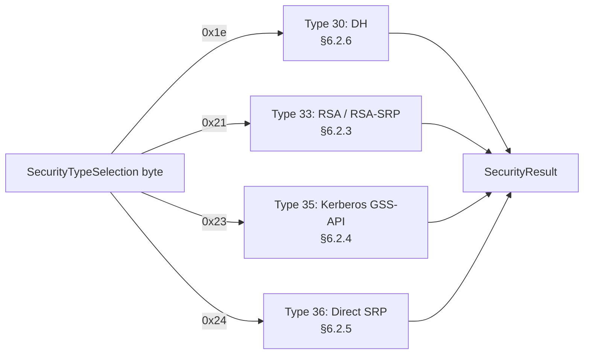
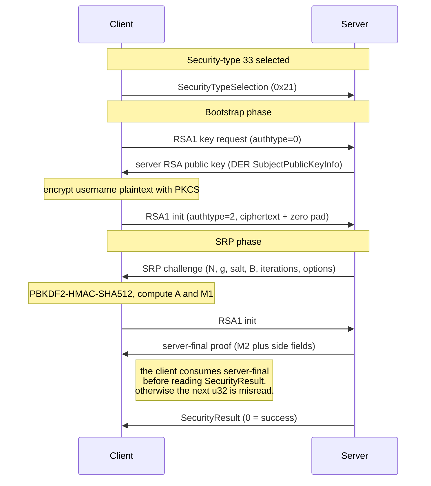
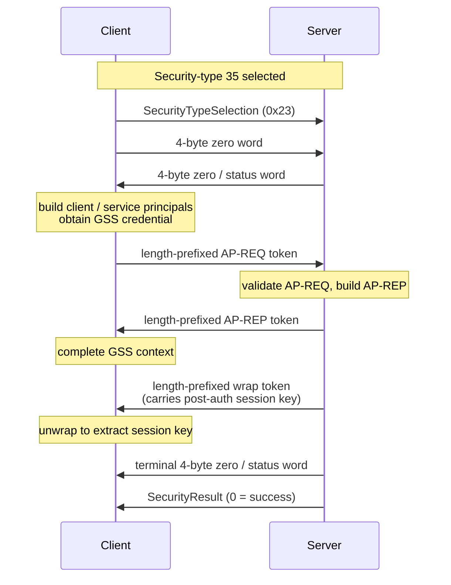
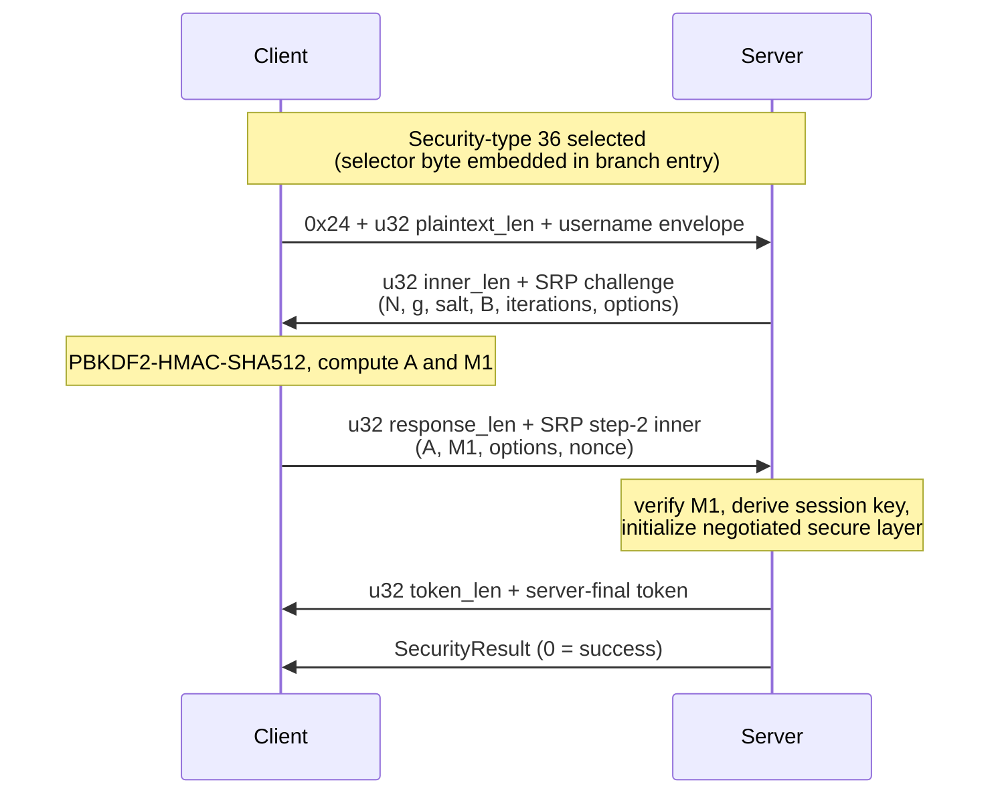
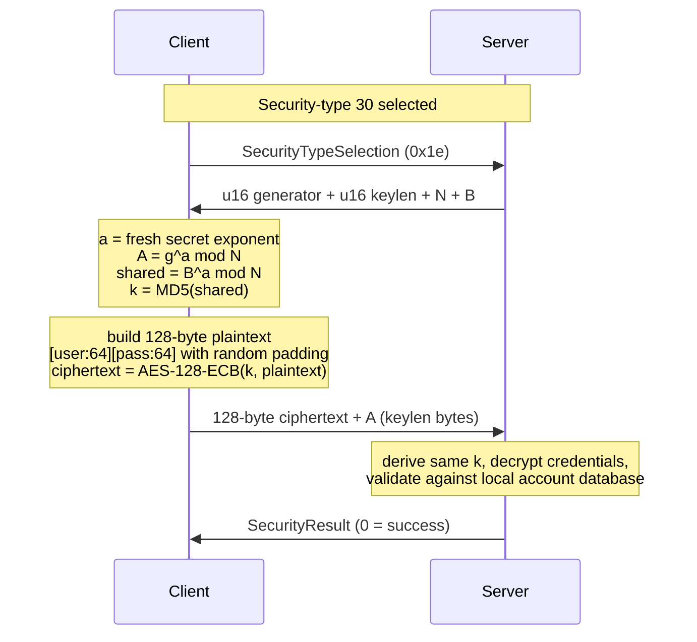
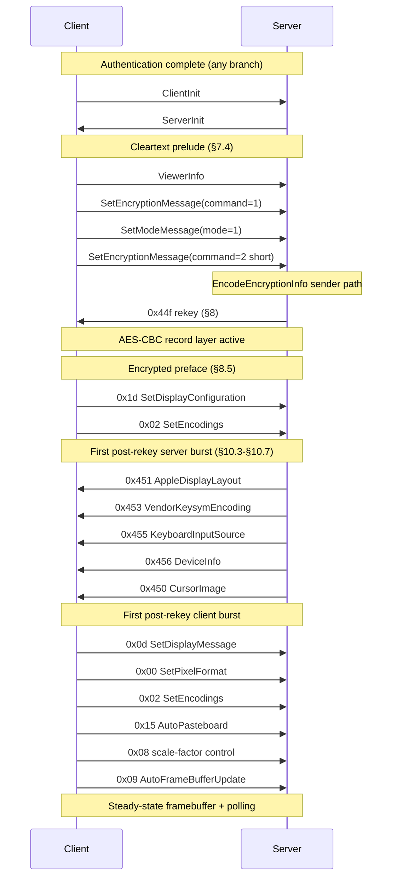
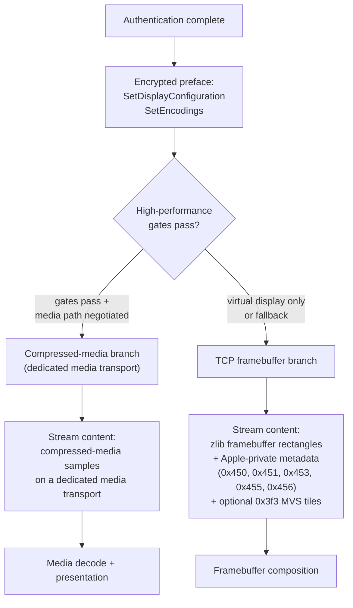

# Apple VNC High-Performance Extension

## Status of This Memo

This document defines the currently specified Apple VNC high-performance session model for the `24G231` baseline.

This memo is written in the style of a protocol specification. It defines the interoperable behavior for the current revision. Where details remain incomplete, this document marks them as revision gaps or implementation-defined behavior rather than leaving the primary protocol narrative ambiguous.

## Abstract

This document specifies an Apple-specific extension layered on top of the Remote Framebuffer protocol. The extension defines:

- multiple Apple authentication branches selected by security type, including `30` (Diffie-Hellman), `33` (`RSA1` / `RSA-SRP`), `35` (Kerberos GSS-API), and `36` (direct SRP)
- a post-auth rekey message that transitions the session into an encrypted record layer
- a display-session configuration model based on vendor-specific control messages
- vendor-specific framebuffer-update encodings carrying layout, cursor, keyboard, device, and media-init information
- a high-performance session model that includes virtual-display behavior and optional media-path negotiation

The currently specified subset is sufficient for a conforming client to authenticate, establish the encrypted transport, configure the display session, process the initial vendor-specific metadata burst, and sustain a functioning framebuffer session.

## 1. Introduction

The Apple VNC high-performance extension augments a standard RFB session with Apple-specific authentication branches, encrypted control transport, display configuration, and high-performance session behavior.

The extension is not a replacement for RFB. It is layered on top of standard RFB version negotiation and framebuffer semantics, while introducing additional control and metadata flows required for Apple-compatible session behavior.

Authentication branch selection and high-performance mode are distinct protocol concerns. Authentication determines how the session is established; high-performance mode, virtual-display behavior, and media-path negotiation are later session properties and MUST NOT be inferred solely from the selected authentication branch. In particular, high-performance sessions are not exclusive to any single authentication type, and observed behavior includes high-performance sessions established through type `30`.

This document is the canonical protocol description for the project. Supporting documents MAY provide reference tables, implementation notes, archive material, or revision tracking, but they do not supersede the definitions stated here.

## 2. Conventions and Terminology

The key words "MUST", "MUST NOT", "REQUIRED", "SHALL", "SHALL NOT", "SHOULD", "SHOULD NOT", "RECOMMENDED", "MAY", and "OPTIONAL" in this document are to be interpreted as described in RFC 2119 and RFC 8174.

The following terms are used throughout this document:

- `client`: the initiating viewer endpoint
- `server`: the remote screen-sharing endpoint
- `record layer`: the encrypted transport used after the rekey message
- `prelude`: the cleartext client messages sent after authentication and before rekeyed control traffic begins
- `encrypted preface`: the first encrypted client messages sent immediately after record-layer enablement
- `virtual display`: a session model in which the server presents a logical display space managed through vendor-specific configuration and layout messages
- `high-performance mode`: the Apple-specific session mode associated with lower-latency display handling and optional media-path behavior
- `revision gap`: a protocol area intentionally marked as not fully specified in this revision

Unless otherwise stated, multi-byte integer fields are encoded in network byte order.

### 2.1 Variable-Length Grammar Atoms

The authentication section uses the following variable-length atoms:

- `%m`: `u16 length || byte[length] value`
- `%o`: `u8 length || byte[length] value`
- `%s`: `u16 length || byte[length] utf8_string`
- `%q`: `u64 value`
- `%u`: `u32 value`

These atoms are part of the maintained grammar notation for auth type `33`.

## 3. Protocol Stages

An Apple VNC high-performance session proceeds in the following phases:

1. RFB version negotiation
2. security-type selection
3. selected authentication branch
4. `SecurityResult`
5. `ClientInit` and `ServerInit`
6. cleartext Apple prelude
7. rekey by `EncodeEncryptionInfo`
8. encrypted preface
9. vendor-specific metadata exchange
10. steady-state framebuffer, control, and optional high-performance behavior

The extension is layered on standard RFB framing. Several Apple-specific behaviors are expressed either as client-to-server control messages or as server-to-client framebuffer-update rectangle encodings.

### 3.1 Stage Separation

For the purposes of this specification, the protocol is divided into the following major stages:

- `handshake stage`: from the first `ProtocolVersion` frame through completed authentication and `SecurityResult`
- `session bootstrap stage`: `ClientInit`, `ServerInit`, and the Apple cleartext prelude
- `secure transport stage`: rekey, encrypted preface, metadata exchange, and steady-state session traffic

This document treats the handshake stage and the secure transport stage as distinct protocol layers.

### 3.2 Connection and Handshake Overview Diagram

The following diagram illustrates the common session outline from TCP establishment through completed authentication:

```text
Client                                                   Server
  |--------------- TCP SYN -------------------------------->|
  |<-------------- TCP SYN-ACK -----------------------------|
  |--------------- TCP ACK -------------------------------->|
  |                                                         |
  |<-------------- ProtocolVersion -------------------------|
  |---------------- ProtocolVersion ----------------------->|
  |<-------------- SecurityTypes ---------------------------|
  |---------------- SecurityTypeSelection ----------------->|
  |=============== selected auth branch ===================>|
  |<--------------- SecurityResult -------------------------|
```

Frame summary:

| Step | Direction | Message | Carries |
|---|---|---|---|
| 1 | Client -> Server | `TCP SYN` | TCP connection open |
| 2 | Server -> Client | `TCP SYN-ACK` | TCP connection open acknowledgement |
| 3 | Client -> Server | `TCP ACK` | TCP connection established |
| 4 | Server -> Client | `ProtocolVersion` | version string |
| 5 | Client -> Server | `ProtocolVersion` | version string |
| 6 | Server -> Client | `SecurityTypes` | count, security types |
| 7 | Client -> Server | `SecurityTypeSelection` | selected security type |
| 8 | Client <-> Server | selected authentication branch | branch-specific authentication traffic |
| 9 | Server -> Client | `SecurityResult` | result, when emitted by the selected branch |

Notes:

- the TCP three-step establishment is shown only as transport context and is not specified further by this document
- the first protocol frame after TCP establishment is `ProtocolVersion` from the server
- the first client-originated authentication frame is `SecurityTypeSelection`
- high-performance mode is not part of the common handshake and MUST NOT be inferred from the selected authentication branch
- auth type `30` is also compatible with later high-performance session behavior

## 4. Session Roles and Model

### 4.1 Basic Roles

The protocol defines a client that requests and renders a remote session and a server that authorizes the client, manages session state, and emits framebuffer and metadata updates.

### 4.2 Session Classes

This revision recognizes at least the following session behaviors:

- standard framebuffer session
- virtual-display framebuffer session
- high-performance session with media-init signaling

A high-performance session MUST NOT be assumed to carry compressed media samples solely because high-performance mode is active. In this revision, high-performance state and media-content transport are treated as related but distinct concerns.

### 4.3 Observe and Control

The protocol supports distinct observe and control paths. The normal control path uses `SetModeMessage(mode=1)` during session bootstrap. Stronger control variations MAY exist, but they are not fully specified in this revision.

## 5. Version and Capability Model

### 5.1 RFB Version

The active protocol baseline uses `RFB 003.889`.

### 5.2 Security-Type Advertisement

The server advertises a list of supported security types during standard RFB security negotiation. The active baseline includes security type `33` alongside other Apple-specific security types.

### 5.3 Client Capability Signaling

The client advertises capability through:

- protocol version
- `ClientInit`
- `ViewerInfo`
- `SetEncodings`

The exact full semantics of all capability bits are not fully specified in this revision. A conforming implementation SHOULD preserve the maintained startup ordering and capability advertisement strategy defined in this document.

## 6. Handshake and Authentication

### 6.1 Handshake

#### 6.1.1 Overview

The common handshake sequence from the first frame through authentication-branch selection is:

```text
Client                                              Server
  |                                                   |
  |<---------------- ProtocolVersion -----------------|
  |----------------- ProtocolVersion ---------------->|
  |<---------------- SecurityTypes -------------------|
  |---------------- SecurityTypeSelection ----------->|
  |=============== enter selected auth flow ==========>|
  |                                                   |
```

After `SecurityTypeSelection`, the connection enters the authentication flow bound to the selected security type. The later high-performance session state is negotiated after authentication and session initialization and is not defined by the authentication branch alone.

#### 6.1.2 Common Handshake Frame Sequence

The common handshake stage contains the following ordered messages:

1. server `ProtocolVersion`
2. client `ProtocolVersion`
3. server security-type list
4. client security-type selection

The messages after step 4 are branch-specific.

#### 6.1.3 ProtocolVersion

The maintained `ProtocolVersion` frame is the standard 12-byte RFB banner:

```text
char[12] "RFB 003.889\n"
```

Frame diagram:

```text
0                   1                   2
0 1 2 3 4 5 6 7 8 9 0 1
+-+-+-+-+-+-+-+-+-+-+-+-+
|R|F|B| |0|0|3|.|8|8|9|\n|
+-+-+-+-+-+-+-+-+-+-+-+-+
```

Offset and range:

| Offset | Size | Field | Range / Value |
|---:|---:|---|---|
| `0` | `12` | `protocol_version` | ASCII `RFB 003.889\n` |

Bit-level interpretation:

- all 12 bytes are ASCII
- no sub-byte fields are defined

#### 6.1.4 Security-Type Advertisement

The security-type list is the standard RFB form:

```text
u8      security_type_count
u8[]    security_types
```

Frame diagram:

```text
0                   1                   2                   3                   4
+-------------------+-------------------+-------------------+-------------------+-------------------+
| security_type_cnt | security_type[0]  | security_type[1]  | security_type[2]  | security_type[3]  |
+-------------------+-------------------+-------------------+-------------------+-------------------+
```

Offset and range:

| Offset | Size | Field | Range / Value |
|---:|---:|---|---|
| `0` | `1` | `security_type_count` | active baseline `4` |
| `1` | `1` | `security_type[0]` | active baseline `30` |
| `2` | `1` | `security_type[1]` | active baseline `33` |
| `3` | `1` | `security_type[2]` | active baseline `36` |
| `4` | `1` | `security_type[3]` | active baseline `35` |

The active baseline advertises:

- `30`
- `33`
- `36`
- `35`

This advertisement does not imply that all sessions use the same authentication branch. The selected security type determines the authentication flow that follows.

#### 6.1.5 Security-Type Selection

The baseline protocol selection frame is one byte, but some security types immediately extend that selection with additional branch-specific bytes. The exact boundary therefore depends on the selected authentication flow.

The shared leading field is:

```text
u8      selected_security_type
```

Frame diagram:

```text
0
+-------------------+
| selected_type     |
+-------------------+
```

Offset and range:

| Offset | Size | Field | Range / Value |
|---:|---:|---|---|
| `0` | `1` | `selected_security_type` | one of the advertised security types |

Observed selections in the maintained notes include:

- `0x21` for auth type `33`
- `0x23` for auth type `35`

An observed type-35 capture also carries a trailing 32-bit zero word after the one-byte selection. That extension is branch-specific and is specified only for the type-35 branch at this time.

### 6.2 Authentication

#### 6.2.1 Flow Registry

The currently maintained security-type registry is:

| Security Type | Provisional Name | Current status |
| ---: | --- | --- |
| `30` | `DH` | Diffie-Hellman / username-password path; specified in §6.2.6 |
| `31` | `Guest Observe` | guest observe path |
| `32` | `Guest Control` | guest control path |
| `33` | `RSA / RSA-SRP` | primary maintained wire specification in this document |
| `34` | `TBD` | not yet identified in this revision |
| `35` | `Kerberos GSS-API` | supported by on-wire `AP-REQ` / `AP-REP` / wrap-token evidence |
| `36` | `Direct SRP` | direct SRP mech path with negotiated secure layer; supported by live forced-36 capture and SRP-layer binary strings |

Important notes:

- `34` remains unspecified in this revision.
- the type-35 capture does not use the known type-33 `RSA1` envelope.
- the type-35 capture carries Kerberos V5 GSS-API tokens on wire.
- the type-36 branch is a direct SRP path with RFC5054-4096 / SHA-512 / PBKDF2 semantics and a negotiated secure layer that includes `ChaCha20-Poly1305`.
- this document currently specifies the type-33 branch in depth and records type-35 and type-36 as separate branches.

#### 6.2.2 Authentication Branches

This specification distinguishes multiple authentication branches selected by the RFB security-type negotiation.

The branches currently tracked are:

1. type `33`: `RSA / RSA-SRP`
   This branch uses the `RSA1` envelope and the SRP material defined in the following sections.
2. type `35`: `Kerberos GSS-API`
   This branch uses length-prefixed Kerberos V5 GSS-API tokens. The currently observed realized flow is:
   - security-type selection
   - client branch-entry payload `0x23 00 00 00 00`
   - server zero/status word
   - client `AP-REQ`
   - server `AP-REP`
   - server short wrap-style token
   - server terminal zero/status word
   - transition to `ClientInit`
3. type `36`: `Direct SRP`
   This branch uses direct SRP challenge and response material without the type-33 `RSA1` envelope. The currently observed option set includes:
   - `mda=SHA-512`
   - `replay_detection`
   - `conf+int=ChaCha20-Poly1305`
   - `kdf=SALTED-SHA512-PBKDF2`
   The currently observed branch-entry payload is `0x24 00 00 00 0f 00 00 00 0b 00 00 00 04 75 73 65 72 00 00 00`.
4. type `30`: `DH`
   This branch is the legacy Apple Remote Desktop scheme. It uses Diffie-Hellman key agreement and an AES-128-ECB encrypted credentials block. See §6.2.6.
5. types `31`, `32`, and `34`
   These branches remain outside the detailed wire scope of this revision.

Figure 6.2-1 illustrates the master selection across the four specified branches:



The server commits to the selected branch and proceeds to the corresponding flow. The four branches share no on-wire envelope; only types `33` and `36` share cryptographic primitives (SRP-6a) but with different framing.

#### 6.2.3 Type 33: RSA / RSA-SRP

##### 6.2.3.1 Flow

The maintained type-33 sequence is:

1. select security type `33`
2. send RSA key-request message
3. receive DER public-key response
4. send RSA-SRP initialization packet
5. receive SRP challenge
6. send SRP response packet
7. receive server final proof
8. receive `SecurityResult`

Authentication is complete only after the final proof and `SecurityResult = 0`.

Figure 6.2.3-1 illustrates the type-33 exchange:



##### 6.2.3.2 RSA1 Envelope and Key Exchange

Type `33` uses the `RSA1` envelope:

```text
u32      total_len
u16      version
char[4]  magic = "RSA1"
u16      authtype
u16      aux
byte[]   body
```

Frame diagram:

```text
0                   4       6               10      12
+-------------------+-------+---------------+-------+-------+-------------------...
| total_len         |version| magic="RSA1"  |auth_t | aux   | body
+-------------------+-------+---------------+-------+-------+-------------------...
```

Field semantics:

- `total_len`: payload length after the outer `u32`
- `version`: envelope version; the maintained baseline uses `0x0100` for auth packets
- `magic`: ASCII `RSA1`
- `authtype`: envelope subtype
- `aux`: subtype-specific control or length field

Known `authtype` values:

- `0`: RSA key request
- `1`: reserved in this revision
- `2`: RSA-SRP path

The key request is the minimal `authtype = 0` envelope with no variable body:

```text
u32     total_len = 10
u16     version
char[4] magic = "RSA1"
u16     authtype = 0
u16     aux = 0
```

The server replies with a key-response payload:

```text
u16     packet_version
u32     der_len
byte[]  der_public_key
```

The `der_public_key` is a DER SubjectPublicKeyInfo blob. The maintained interoperable key is `2048` bits with public exponent `65537`.

##### 6.2.3.3 Client Packet-1

The first client auth packet is a type-33 `RSA1` envelope with:

- `version = 0x0100`
- `magic = "RSA1"`
- `authtype = 2`
- `aux = 0x0100`

The maintained body shape is:

- first `256` bytes: RSA ciphertext
- remaining `384` bytes: zero-filled tail

Frame diagram:

```text
0                   4       6               10      12      14
+-------------------+-------+---------------+-------+-------+-------------------+-------------------+
| total_len         |0x0100 | "RSA1"        |0x0002 |0x0100 | encrypted_payload | zero_tail
+-------------------+-------+---------------+-------+-------+-------------------+-------------------+
                                                                  256 bytes           384 bytes
```

Computation rule:

1. construct the packet-1 plaintext:
   - `u32 payload_len`
   - empty string field
   - login user name field
   - empty string field
   - empty opaque field
2. encrypt the plaintext with the server DER RSA public key using PKCS#1 padding
3. place the resulting `256`-byte ciphertext at the start of the body
4. zero-fill the remaining `384` bytes
5. emit the `RSA1` envelope with `authtype = 2`

Bit-level interpretation:

- the outer length, `version`, `authtype`, and `aux` fields are big-endian integers
- the encrypted payload is opaque at bit level
- the trailing `384` bytes are all zero in the maintained interoperable form

##### 6.2.3.4 Server Challenge

The server challenge packet carries:

- one control byte
- modulus `N`
- generator `g`
- salt
- server public value `B`
- PBKDF2 iteration count
- options string

The maintained challenge payload grammar is:

```text
u8      control
%m      N
%m      g
%o      salt
%m      B
%q      iterations
%s      options
```

Outer packet diagram:

```text
0                   4                   8       10                  14
+-------------------+-------------------+-------+-------------------+-------------------...
| total_len         | step_or_msg       | x     | payload_len       | challenge_payload
+-------------------+-------------------+-------+-------------------+-------------------...
```

The maintained relationship is:

- `x = payload_len + 4`

The active baseline uses:

- `g = 0x05`
- `iterations = 156250`
- options string containing `mda=SHA-512` and `kdf=SALTED-SHA512-PBKDF2`

All outer integer fields are big-endian. The grammar atoms `%m`, `%o`, `%s`, and `%q` are defined in Section 2.1.

##### 6.2.3.5 Client Packet-2

The second client auth packet carries the SRP response material. It is a type-33 `RSA1` envelope with:

- `version = 0x0100`
- `magic = "RSA1"`
- `authtype = 2`
- `aux = 0x02aa`

The maintained body shape is:

```text
u16     preamble = 0
u16     inner_len
byte[]  inner
byte[]  trailing_tail
```

The active interoperable `inner` grammar is:

```text
%m      A
%o      M1
%s      options
%o      client_random
```

Where:

- `A`: client SRP public value, padded to the width of `N`
- `M1`: client SRP proof
- `options`: copied from the challenge
- `client_random`: fresh 16-byte random value

The bounded `inner` blob is authoritative for interoperability. The trailing body bytes beyond `aux` are not required and MUST NOT be needed for successful authentication in this revision.

##### 6.2.3.6 SRP Derivation

Type-33 password preprocessing uses:

- `PBKDF2-HMAC-SHA512(password_utf8, salt, iterations, dkLen=128)`

The processed password material is referred to here as `P'`.

The maintained SRP model uses:

- `PAD(x)`: left-padding to the width of `N`
- `H`: SHA-512
- `OS2IP`: big-endian octet-string-to-integer conversion

The maintained formulas are:

```text
x  = H(salt || H(":" || P'))
k  = OS2IP(H(PAD(N) || PAD(g)))
A  = g^a mod N
u  = OS2IP(H(PAD(A) || PAD(B)))
v  = g^x mod N
S  = (B - k*v mod N)^(a + u*x) mod N
K  = H(PAD(S))
M1 = H(H(PAD(N)) xor H(PAD(g)), H(""), salt, PAD(A), PAD(B), K)
```

Where:

- `a` is a fresh non-zero client secret exponent
- `B` is the server SRP public value
- `K` is the hashed shared secret

##### 6.2.3.7 Server Final Proof and Result

On successful authentication, the server emits a final proof packet followed by standard RFB `SecurityResult`.

The maintained final-proof payload grammar is:

```text
%o      server_proof
%o      server_random
%s      empty_string
%u      zero
```

Outer packet diagram:

```text
0                   4                   8       10                  14
+-------------------+-------------------+-------+-------------------+-------------------...
| total_len         | step_or_msg       | x     | payload_len       | final_proof_payload
+-------------------+-------------------+-------+-------------------+-------------------...
```

The server then sends:

```text
u32     result
```

For success:

- `result = 0x00000000`

Completion rule:

1. the client processes the server final proof
2. the client receives `SecurityResult = 0`
3. only then does the session enter `ClientInit` / `ServerInit`

Transcript summary:

```text
Server -> Client  : ProtocolVersion
Client -> Server  : ProtocolVersion
Server -> Client  : SecurityTypes
Client -> Server  : SecurityTypeSelection
Client -> Server  : RSA1 Key Request
Server -> Client  : RSA1 Key Response
Client -> Server  : RSA1 SRP Init
Server -> Client  : SRP Challenge
Client -> Server  : SRP Response
Server -> Client  : SRP Final Proof
Server -> Client  : SecurityResult
```

#### 6.2.4 Type 35: Kerberos GSS-API

##### 6.2.4.1 Flow Summary

The currently observed type-35 authentication flow is:

1. client selects security type `35`
2. client emits branch-entry payload `23 00 00 00 00`
3. server emits a 32-bit zero word
4. client emits a length-prefixed Kerberos V5 GSS-API token carrying `AP-REQ`
5. server emits a length-prefixed Kerberos V5 GSS-API token carrying `AP-REP`
6. server emits a short Kerberos per-message token with wrap-token prefix `05 04`
7. server emits a terminal 32-bit zero word
8. client transitions to `ClientInit`

This flow summary is maintained from corrected on-wire observation of the type-35 branch.

Figure 6.2.4-1 illustrates the type-35 exchange:



##### 6.2.4.2 Current Wire Model

The current maintained type-35 wire model is:

- branch-entry payload `0x23 00 00 00 00`
- server zero word
- one length-prefixed client token
- two server-side branch tokens
- one terminal server zero word

The maintained type-35 token interpretation is:

- the large client token is a GSS initial-context token
- the token contains Kerberos V5 GSS mechanism OID `1.2.840.113554.1.2.2`
- the inner Kerberos mechanism token is `APPLICATION 14` / `AP-REQ`
- the server reply token is `APPLICATION 15` / `AP-REP`
- the short server follow-up token begins with `05 04`, consistent with a Kerberos GSS wrap token

This branch is therefore maintained as Kerberos V5 GSS-API from on-wire evidence, even though its product-facing Apple label is not surfaced in the current stripped binaries.

#### 6.2.5 Type 36: Direct SRP

##### 6.2.5.1 Flow Summary

The currently observed type-36 branch is a direct SRP path rather than the type-33 `RSA1`-wrapped flow.

The maintained evidence indicates:

1. the client enters the branch with payload `24 00 00 00 0f 00 00 00 0b 00 00 00 04 75 73 65 72 00 00 00`
2. the server emits a length-prefixed SRP challenge
3. the client emits a length-prefixed SRP response
4. the branch negotiates SRP options directly
5. the option set includes:
   - `mda=SHA-512`
   - `replay_detection`
   - `conf+int=ChaCha20-Poly1305`
   - `kdf=SALTED-SHA512-PBKDF2`
6. the branch initializes its secure layer from the negotiated options and then transitions into framed encrypted records

This flow summary is maintained from on-wire observation of the type-36 branch.

Figure 6.2.5-1 illustrates the type-36 exchange:



##### 6.2.5.2 Current Wire Model

The maintained type-36 branch-entry and early challenge/response model is:

- client branch-entry payload:

```text
24 00 00 00 0f 00 00 00 0b 00 00 00 04 75 73 65 72 00 00 00
```

- first large server challenge payload parses as:

```text
%c%m%m%o%m%q%s
```

with maintained semantics:

- `%c` : branch-local SRP mode byte
- `%m` : RFC5054 4096-bit modulus `N`
- `%m` : generator `g` (`0x05`)
- `%o` : salt
- `%m` : server SRP public value `B`
- `%q` : PBKDF2 iteration count
- `%s` : option string `mda=SHA-512,replay_detection,conf+int=ChaCha20-Poly1305,kdf=SALTED-SHA512-PBKDF2`

The present maintained conclusions are:

- it is not the type-33 `RSA1` envelope path
- it is the direct SRP mech path in the viewer, not a separate iCloud-only transport identifier
- it negotiates both SRP authentication and secure-layer parameters directly
- the negotiated secure layer includes integrity and confidentiality protection
- the binary strings for this option set resolve into `_ParseOptions`, `_OptionsToString`, `_LayerInit`, and `_srp_client_mech_step`
- the direct type-36 path is therefore best maintained as modern `SRP-RFC5054-4096-SHA512-PBKDF2` plus negotiated secure-layer setup

The full record-layer grammar after the initial SRP exchange remains to be completed in a later revision.

#### 6.2.6 Type 30: Diffie-Hellman

##### 6.2.6.1 Flow Summary

The maintained type-30 sequence is:

1. select security type `30`
2. receive a server DH challenge announcing generator, modulus, and the server public value
3. encrypt a fixed-size credentials block with a key derived from the DH shared secret
4. send the encrypted credentials block followed by the client DH public value
5. receive `SecurityResult`

Type 30 predates the Apple SRP families and is still advertised by current servers. It is the legacy `Apple Remote Desktop` authentication path.

Figure 6.2.6-1 illustrates the type-30 exchange:



##### 6.2.6.2 Server Challenge

The server emits:

```text
u16     generator
u16     keylen
byte[]  modulus_N         (length = keylen)
byte[]  server_public_B   (length = keylen)
```

The maintained interoperable group is `1024`-bit MODP. The wire fields are big-endian.

##### 6.2.6.3 Client Response

The client computes:

1. fresh secret exponent `a`
2. `A = g^a mod N`
3. `shared = B^a mod N`
4. `k = MD5(shared)`
5. plaintext credentials block:

```text
byte[64]  username   (null-terminated UTF-8, remainder filled with cryptographic random bytes)
byte[64]  password   (null-terminated UTF-8, remainder filled with cryptographic random bytes)
```

6. `ciphertext = AES-128-ECB(k, plaintext)` — exactly 8 blocks of 16 bytes

The client then emits:

```text
byte[128]   ciphertext
byte[]      client_public_A   (length = keylen)
```

##### 6.2.6.4 Cryptographic Profile

- Diffie-Hellman 1024-bit MODP, generator `2` (some servers use `5`)
- key derivation: `key = MD5(shared)` — 16 bytes used as AES-128 key
- record cipher: AES-128-ECB over a fixed 128-byte plaintext

The plaintext padding (random bytes after the null terminators) ensures different sessions produce different ciphertexts even when the same credentials are reused.

##### 6.2.6.5 Authentication Result

The session continues with `ClientInit` and `ServerInit` upon `SecurityResult = 0`. Type 30 does not produce a post-auth session key consumed by the later record layer; the Apple AES-CBC record layer activates only after `EncodeEncryptionInfo` (§8).

#### 6.2.7 Setup Tasks

The next concrete tasks for type `35` and type `36` are:

1. type `35`: determine whether the client-side trailing zero word in `23 00 00 00 00` is mandatory protocol syntax or just the currently observed native encoding.
2. type `35`: identify the client and server functions that build and consume the Kerberos GSS tokens so the branch can be tied to concrete binary entry points, not only packet evidence.
3. type `36`: decode the first large client response body after the server SRP challenge and map it to the corresponding SRP step fields.
4. type `36`: separate the initial SRP secure-layer setup from the later encrypted record layer and document the boundary precisely.
5. type `34`: keep unresolved in this revision; do not infer its semantics from the now-better-understood type-35 and type-36 paths.

#### 6.2.8 Branch Summary

```text
Server -> Client  : ProtocolVersion
Client -> Server  : ProtocolVersion
Server -> Client  : SecurityTypes
Client -> Server  : SecurityTypeSelection
Client <-> Server : selected authentication branch
Client -> Server  : ClientInit
Server -> Client  : ServerInit
```

## 7. Session Initialization

### 7.1 Post-Auth RFB Initialization

After successful authentication:

1. the client sends `ClientInit`
2. the server sends `ServerInit`

### 7.2 ClientInit

The active baseline uses a `ClientInit` value that includes:

- the standard shared-session bit
- an enhanced-mode bit
- a session-select bit

The full semantics of those bit combinations are not completely specified in this revision, but the interoperable variant is `0xC1`.

Known active bits in the maintained baseline:

- `0x01`: shared-session flag
- `0x40`: session-select related flag
- `0x80`: extended-mode flag

### 7.3 ServerInit

The active baseline uses a standard `ServerInit` carrying:

- framebuffer width and height
- pixel format
- name string

The name field MAY carry additional vendor-specific prefix material before the human-readable name.

### 7.4 Cleartext Prelude

The maintained cleartext prelude is:

1. `ViewerInfo`
2. `SetEncryptionMessage(command=1, method=1)`
3. `SetModeMessage(mode=1)`
4. short `SetEncryptionMessage(command=2, value=1)`

This ordering SHOULD be preserved for compatibility.

### 7.5 ViewerInfo

`ViewerInfo` is a fixed-format client capability message sent before the encrypted transport becomes active.

This revision defines `ViewerInfo` as containing:

- a version field
- client application version fields
- system version fields
- a command-support bitmap

The exact complete semantics of every command bit are not fully specified in this revision.

The maintained `ViewerInfo` wire shape is:

```text
u8      type = 0x21
u8      reserved
u16     body_len
u16     viewer_info_version
u32     viewer_app
u32     viewer_app_major
u32     viewer_app_minor
u32     viewer_app_bugfix
u32     system_major
u32     system_minor
u32     system_bugfix
byte[32] command_bitmap
```

For the active baseline, `body_len` is the length of the structure following the initial 4-byte message prefix.

### 7.6 SetEncryptionMessage

`SetEncryptionMessage` is the pre-rekey control message that enables encrypted receive handling and related session state.

This revision defines two relevant forms:

- command `1` form used in the cleartext prelude
- short command `2` form used in the maintained startup sequence

The maintained command `1` form is:

```text
u8      type = 0x12
u8      reserved
u16     message_version
u16     encryption_command
u16     method_count
u32     encryption_method
```

The maintained short command `2` form is:

```text
u8      type = 0x12
u8      reserved
u16     encryption_command = 2
u16     value
u16     reserved
```

### 7.7 SetModeMessage

`SetModeMessage` selects the requested session mode. This revision defines:

- `mode=0`: observe
- `mode=1`: normal control

Other mode values are not fully specified.

The maintained wire shape is:

```text
u8      type = 0x0a
u8      reserved
u16     mode
```

## 8. Rekey and Secure Transport

### 8.1 Rekey Message

The message `EncodeEncryptionInfo` with encoding `0x44f` is the rekey boundary between the cleartext prelude and the encrypted record layer.

The rekey message is carried as a standard `FramebufferUpdate` rectangle.

### 8.2 Rekey Payload

The maintained `0x44f` model includes:

- one generation or counter field
- one protected block carrying the next transport key
- one protected block carrying the companion transport IV

The exact semantics of the generation field remain a revision gap.

The maintained payload shape is:

```text
u32     generation
byte[16] encrypted_key
byte[16] encrypted_iv
```

The message is carried inside a single-rectangle `FramebufferUpdate` with encoding `0x44f`.

### 8.3 Record-Layer Activation

After `0x44f`, both endpoints transition to the Apple encrypted record layer.

This revision defines the steady-state record layer as:

- length-prefixed
- AES-CBC protected
- sequence-aware
- integrity protected

### 8.4 Record-Layer Properties

The record layer contains:

- an inner plaintext length
- message body
- padding to block alignment
- an integrity trailer

Record-layer boundaries MUST NOT be assumed to coincide with higher-level message boundaries once large framebuffer payloads begin.

The maintained plaintext model is:

```text
u16     plaintext_len
byte[]  body
byte[]  pad
byte[20] integrity
```

The maintained outer transport model is:

```text
u16     ciphertext_len
byte[]  ciphertext
```

Constraints:

- `ciphertext_len` MUST be a multiple of the block size
- `plaintext_len` covers the unpadded message body only
- `integrity` is sequence-dependent
- the record layer is message-preserving for small control traffic but MUST NOT be assumed to expose one higher-level message per transport record once large framebuffer traffic begins

The client and server each maintain independent send and receive record-layer sequence numbers. The exact initialization and advancement rules are stable enough for interoperability, but the full sequence specification is not completely restated in this revision.

### 8.5 Encrypted Preface

Immediately after record-layer activation, the client sends:

1. `SetDisplayConfiguration` (`0x1d`)
2. `SetEncodings` (`0x02`)

These messages form the encrypted preface and MUST precede the later display-selection burst.

The encrypted preface consumes the first two client send-sequence positions in the maintained startup model.

## 9. Session Configuration and Display Selection

### 9.1 SetDisplayConfiguration

`SetDisplayConfiguration` (`0x1d`) is the principal client message for display-session configuration.

This revision defines the following:

- it is required during the encrypted preface
- it carries one or more display descriptors
- it controls entry into the useful virtual-display branch
- the accepted payload body is stable enough for interoperable transmission

The message includes:

- a message size
- a message version
- a display count
- message flags
- display descriptor payloads

Some field-level semantics inside the display descriptor remain implementation-defined in this revision.

The maintained front header shape is:

```text
u8      type = 0x1d
u8      reserved
u16     message_size
u16     message_version
u16     display_count
u32     message_flags
byte[]  display_descriptors
```

The active maintained body length is `308` bytes for the single-display interoperable form.

The maintained single-display descriptor model includes:

- one descriptor size field
- one opaque display-info region
- one display flags field
- one display type field
- one physical width field
- one physical height field
- one maximum width field
- one maximum height field
- one current mode index
- one preferred mode index
- one implementation-defined 32-bit field
- one mode-count field
- one mode table

The maintained descriptor layout is:

```text
u16     display_info_size
byte[0x78] display_info_region
u32     display_flags
u32     display_type
u32     physical_width
u32     physical_height
u32     max_width
u32     max_height
u16     current_mode_index
u16     preferred_mode_index
u32     implementation_defined
u16     mode_count
byte[]  mode_table
```

The active baseline defines:

- `display_info_region` length = `0x78`
- `mode_count` = `5`
- dynamic-resolution flag bit = `0x00000001`

The exact complete meaning of `display_info_region` is not fully specified in this revision.

### 9.2 Mode Table

Each display mode entry in the maintained mode table has the following structure:

```text
u32     width
u32     height
u32     scaled_width
u32     scaled_height
f64     refresh_rate
u32     flags
```

This revision defines the mode table as the advertised set of display operating points for the current display descriptor.

### 9.3 Dynamic Resolution Behavior

When dynamic resolution is active:

- `display_flags` SHOULD set the dynamic-resolution flag
- `current_mode_index` and `preferred_mode_index` SHOULD select valid table entries
- `max_width` and `max_height` define the largest advertised backing geometry
- later layout messages MAY reduce the active backing size below the maximum

### 9.4 SetDisplayMessage

`SetDisplayMessage` (`0x0d`) selects or resets the active display model after the initial encrypted preface.

This revision defines the known interoperable body:

- `0x0d01000000000000`

This body selects the default combined-display aggregate.

The maintained wire shape is:

```text
u8      type = 0x0d
u8      combine_all_displays
u16     reserved
u32     display_id
```

If `combine_all_displays` is non-zero, `display_id` is ignored for the interoperable combined-display case.

### 9.5 Display Layout Updates

The server MAY later emit layout updates that change the effective display geometry. A conforming client MUST accept runtime changes in display dimensions and MUST resize local framebuffer state before applying rectangles that assume the new geometry.

## 10. Message Encodings

### 10.1 Standard Messages

The session continues to use standard RFB messages such as:

- `FramebufferUpdate`
- `SetPixelFormat`
- `SetEncodings`
- `FramebufferUpdateRequest`

### 10.2 Apple-Specific Messages and Encodings

This revision defines the following Apple-specific families:

- `0x44f` `EncodeEncryptionInfo`
- `0x450` `CursorImage`
- `0x451` `AppleDisplayLayout`
- `0x453` `VendorKeysymEncoding`
- `0x455` `KeyboardInputSource`
- `0x456` `DeviceInfo`
- `0x3f2` `RFBMediaStreamMessage1`

### 10.3 CursorImage (`0x450`)

`CursorImage` communicates cursor image state.

This revision defines:

- the rectangle header carries hotspot and dimensions
- the payload contains a cache identifier
- compressed payloads encode color plus alpha planes
- zero-length compressed payload indicates cache reuse semantics

The compressed form is compatible with incremental inflate even when the payload does not present as a complete standalone zlib stream with normal end-of-stream signaling.

The maintained payload prefix is:

```text
u32     cache_id
u32     compressed_len
byte[]  compressed_cursor_payload
```

If `compressed_len` is zero, the payload refers to a previously cached cursor image.

Decoded content model:

```text
byte[width*height*4] color_plane
byte[width*height]   alpha_plane
```

### 10.4 AppleDisplayLayout (`0x451`)

`AppleDisplayLayout` communicates display geometry and layout state.

This revision defines:

- direction: server to client
- transport class: framebuffer-update rectangle
- the message is required for practical display sizing
- it may advertise dynamic geometry changes during the session
- it may describe both logical display size and backing size
- a client MUST treat it as authoritative for framebuffer sizing

The full field-level schema is not fully specified in this revision.

Known semantics in this revision:

- the message carries authoritative display geometry
- both logical display size and backing size may be present
- later messages may reduce the effective backing size during the session

The maintained interoperable prefix is:

```text
u16     payload_len
u16     reserved_or_version
u16     display_width
u16     display_height
u16     backing_width
u16     backing_height
byte[]  trailing_fields
```

The field names above are conceptual names for the currently interoperable subset.

Client requirements:

- a client MUST treat the advertised layout as authoritative for framebuffer sizing
- a client SHOULD interpret display-width and display-height values as the logical display space
- a client SHOULD interpret backing-width and backing-height values as the framebuffer backing space
- a client MUST be prepared for later layout messages that reduce backing size after initial startup

Recommended client rule for this revision:

- logical layout values govern display-space interpretation
- backing values govern framebuffer allocation and update bounds

Revision gaps:

- the exact complete field inventory after the interoperable prefix
- the exact distinction between all logical, scaled, backing, and presentation-space values
- the full relation between this message and later desktop-size signaling

### 10.5 VendorKeysymEncoding (`0x453`)

`VendorKeysymEncoding` communicates Apple-specific keyboard or keysym capability state.

This revision defines it as a vendor capability advertisement that the client MUST accept if requested during session startup.

This revision defines:

- direction: server to client
- transport class: framebuffer-update rectangle
- function: vendor keysym capability advertisement

The maintained conceptual payload model is:

```text
u16     payload_len
u16     version
u32     value_0
u32     value_1
u32     value_2
u32     value_3
```

The maintained payload contains a version field followed by a fixed set of vendor keysym values.

Client requirements:

- a client MUST accept this message during startup if the corresponding encoding was advertised
- a client MAY treat the four vendor values as opaque capability selectors if their exact symbolic meaning is not implemented
- a client MUST NOT terminate the session solely because the exact semantic label of an advertised vendor keysym is unknown

Revision gaps:

- the exact normative symbolic mapping for each vendor keysym value
- the full behavioral effect of each capability flag on later input handling

### 10.6 KeyboardInputSource (`0x455`)

`KeyboardInputSource` communicates keyboard-input-source state.

This revision defines it as a server-to-client metadata message associated with current keyboard layout or input-source selection.

This revision defines:

- direction: server to client
- transport class: framebuffer-update rectangle
- function: keyboard input-source advertisement

The maintained conceptual payload model is:

```text
u16     payload_len
u16     version
u16     flags
u16     string_len
byte[]  input_source_identifier
byte[]  trailing_fields
```

The maintained payload contains:

- a version
- flags
- a string length
- an input-source identifier string

The active interoperable identifier form is a UTF-8 string naming the current input-source or keyboard-layout identifier.

Client requirements:

- a client MUST accept this message during startup and steady-state metadata updates
- a client SHOULD preserve the current input-source identifier for later local input mapping, display, or policy decisions
- a client MAY treat unknown trailing fields as reserved

Revision gaps:

- the complete semantic meaning of the flags field
- the presence and meaning of any trailing fields after the identifier string
- the exact synchronization rule between this message and later keyboard-state control traffic

### 10.7 DeviceInfo (`0x456`)

`DeviceInfo` communicates server device metadata.

This revision defines it as structured server device-description information.

This revision defines:

- direction: server to client
- transport class: framebuffer-update rectangle
- function: server device metadata advertisement

The maintained payload contains:

- a version
- a block count
- flags
- one or more strings
- a trailing integer field associated with device presentation metadata

The maintained conceptual payload model is:

```text
u16     payload_len
u16     version
u16     block_count
u16     flags
u16     string_0_len
u16     string_1_len
u16     string_2_len
byte[]  string_0
byte[]  string_1
byte[]  string_2
u32     trailing_value
```

The currently interoperable interpretation is:

- `string_0`: model-like identifier
- `string_1`: enclosure or presentation string
- `string_2`: housing or presentation string
- `trailing_value`: device presentation attribute

Client requirements:

- a client MUST accept this message during startup metadata exchange
- a client MAY display or cache the strings as descriptive device metadata
- a client MUST NOT rely on all optional strings being non-empty

Revision gaps:

- the exact normative names of every string field
- the exact semantic meaning of the trailing integer field
- the complete multi-block behavior when `block_count` is greater than one

### 10.8 RFBMediaStreamMessage1 (`0x3f2`)

`RFBMediaStreamMessage1` is the currently known media-init message family.

This revision defines:

- the server MAY emit it after the client advertises `0x3f2`
- it announces media-stream configuration state
- it includes stream-port and stream-count style information
- it is not by itself proof that visible content has transitioned to compressed media samples

Known semantics in this revision:

- one version field is present
- the payload advertises a base UDP port
- the payload advertises stream count
- the payload advertises at least one subsequent stream port

The maintained conceptual payload model is:

```text
u16     message_size_or_versioned_size
u16     version
u32     base_udp_port
u32     stream_count
u32     next_stream_port
byte[]  reserved_or_future_fields
```

The active baseline uses a version `1` form.

### 10.9 Apple Codec Encodings

In addition to the metadata encodings defined in §10.3–§10.8, the server MAY emit framebuffer-update rectangles using Apple-specific codec encodings selected by the client's negotiated quality tier.

#### 10.9.1 Encoding Identifiers

| Encoding | Name | Class |
|---|---|---|
| `0x06` | Standard zlib | classical RFB; 32-bit pass-through |
| `0x3e8` | Low Quality | Apple codec, 4-bit color reduction |
| `0x3e9` | Medium Quality | Apple codec, 8-bit dithering |
| `0x3ea` | High Quality | Apple codec, 16-bit RGB 5-6-5 |
| `0x3f3` | Multi-Variant Scaled | per-tile adaptive codec |

#### 10.9.2 Quality Tier Selection

A conforming client SHOULD select one of five tier sets when advertising encodings:

| Tier | Encodings Advertised |
|---|---|
| Full | `zlib, copyrect` |
| Low | `0x3e8, zlib, zrle` |
| Medium | `0x3e9, zlib, zrle` |
| High | `0x3f3, 0x3ea, zlib, zrle` |
| High + media-init | `0x3f2, 0x3f3, 0x3ea, zlib, zrle` |

A client MAY restrict its advertised set to encodings it can decode. The High tier with `0x3f3` and `0x3ea` is the maintained default for current sessions.

#### 10.9.3 Encoder Pipeline

Encodings `0x3e8`, `0x3e9`, `0x3ea`, and `0x06` share a common zlib-based pipeline, differentiated by pixel pre-processing and deflate level:

| Encoding | Pre-processing | Deflate level |
|---|---|---|
| `0x3e8` | 4-bit color (16-color palette per 8-pixel block) | `9` |
| `0x3e9` | 8-bit YCoCg dithering, 2 pixels per byte | `6` |
| `0x3ea` | 16-bit RGB 5-6-5 color | `1` |
| `0x06` | 32-bit color, pass-through | `1` |

Compression level varies inversely with quality.

#### 10.9.4 Multi-Variant Scaled (`0x3f3`)

`0x3f3` is a per-tile adaptive codec distinct from the shared zlib pipeline. Its rectangle body has the form:

```text
u8      tile_width
u8      tile_height
byte[]  command_bitstream     (per-tile type codes, run-length encoded)
byte[]  render_data           (DCT coefficients, palette colors, masks)
byte[]  trailer               (length fields; nominal 20 bytes)
```

The command bitstream identifies each tile by one of the following types:

| Command | Name | Render data |
|---|---|---|
| `0` | White / Skip | none |
| `1` | MatchPrevious | none (reuse same-position tile from previous frame) |
| `2` | MatchAbove | none (reuse tile from row above) |
| `3` | TwoColor (B&W) | 8-byte pixel mask plus two colors (YCoCg, 8/6/6 bits) |
| `4` | TwoColor | 8-byte pixel mask plus two colors (YCoCg, 8/6/6 bits) |
| `5..n` | DCT | quantized DCT coefficients in YCoCg color space |
| `0x6d` | End marker | none |

Colors are encoded in YCoCg color space with 8/6/6-bit quantization. The DCT quantization table is fixed for the baseline.

Tiles are nominally `8 × 8` pixels. Tile geometry within a rectangle is `tile_width × tile_height` tiles laid out row-major.

The exact bit-packing of the command bitstream and the exact DCT coefficient encoding are not fully specified in this revision and are tracked as revision gaps (§19).

#### 10.9.5 Client Behavior

A client MUST tolerate codec-encoded rectangles whose decoding it does not implement: such a client SHOULD NOT advertise the corresponding encoding in `SetEncodings`. A client MAY fall back to advertising only `0x06` (standard zlib) when it cannot decode any Apple codec encoding.

A client that advertises `0x3f3` or `0x3ea` MUST be prepared to decode rectangles using those encodings; the server is not required to fall back to `0x06` once a codec encoding is advertised.

## 11. Startup Message Ordering

### 11.1 Maintained Ordering

The maintained startup ordering is:

1. authentication completion
2. `ClientInit`
3. `ServerInit`
4. `ViewerInfo`
5. `SetEncryptionMessage(command=1)`
6. `SetModeMessage(mode=1)`
7. short `SetEncryptionMessage(command=2)`
8. `EncodeEncryptionInfo`
9. encrypted `SetDisplayConfiguration`
10. encrypted `SetEncodings`
11. first server metadata burst
12. encrypted `SetDisplayMessage`
13. encrypted `SetPixelFormat`
14. encrypted `SetEncodings`
15. encrypted `AutoPasteboard`
16. additional control and update cycles

### 11.2 Compatibility Requirement

Clients SHOULD preserve this ordering unless a later revision of the specification defines a compatible alternative.

### 11.3 End-to-End Startup Diagram

Figure 11-1 illustrates the message order from authentication completion through the first post-rekey control burst:



## 12. Message Summary Tables

### 12.1 Client-to-Server Messages

| Message | Type | Phase | Status |
|---|---:|---|---|
| `ViewerInfo` | vendor-specific | cleartext prelude | partially specified |
| `SetEncryptionMessage` | `0x12` | cleartext prelude | partially specified |
| `SetModeMessage` | `0x0a` | cleartext prelude | specified |
| `SetDisplayConfiguration` | `0x1d` | encrypted preface | partially specified |
| `SetDisplayMessage` | `0x0d` | post-preface control | specified subset |
| `SetPixelFormat` | `0x00` | post-preface control | inherited from RFB |
| `SetEncodings` | `0x02` | preface and steady state | inherited plus vendor values |
| `FramebufferUpdateRequest` | `0x03` | steady state | inherited from RFB |

### 12.2 Server-to-Client Encodings

| Encoding | Name | Status |
|---|---:|---|
| `0x44f` | `EncodeEncryptionInfo` | specified subset |
| `0x450` | `CursorImage` | partially specified |
| `0x451` | `AppleDisplayLayout` | partially specified |
| `0x453` | `VendorKeysymEncoding` | partially specified |
| `0x455` | `KeyboardInputSource` | partially specified |
| `0x456` | `DeviceInfo` | partially specified |
| `0x3f2` | `RFBMediaStreamMessage1` | specified subset |

## 13. Conformance

### 13.1 Minimal Client Conformance

A minimally conforming client for this revision:

- implements security type `33`
- supports the `RSA1` envelope and SRP response generation
- sends the cleartext prelude in the defined order
- transitions correctly at `0x44f`
- sends encrypted `SetDisplayConfiguration` and encrypted `SetEncodings`
- accepts the initial Apple metadata burst
- resizes correctly on layout changes
- sustains a framebuffer-backed virtual-display session

This conformance level corresponds to the minimum capability required for a client to authenticate, establish the encrypted transport, and sustain a framebuffer-backed session.

### 13.2 Extended Client Conformance

An extended client for this revision also:

- processes cursor cache and cursor image updates
- processes keyboard input-source metadata
- advertises `0x3f2` when media-init probing is desired
- tolerates high-performance mode without assuming compressed-media content delivery

### 13.3 Server Conformance

A conforming server for this revision:

- supports the auth type `33` bootstrap sequence
- emits `0x44f` before record-layer activation
- accepts the encrypted preface ordering
- emits layout and metadata messages in a form compatible with the structures defined in this document
- may remain on framebuffer content delivery even in high-performance mode

## 14. High-Performance Extension

### 14.1 Definition

High-performance mode is the Apple extension state associated with:

- virtual-display behavior
- dynamic display/layout handling
- lower-latency session characteristics
- optional media-path signaling

High-performance mode is a session-state property. It is not an authentication property and is not bound to any single security type.

### 14.2 Current Interoperable Model

This revision defines the current interoperable high-performance model as follows:

- a session may become a virtual-display session
- the visible content path may still remain a framebuffer path
- media-path signaling may exist without a confirmed switch to sustained compressed media delivery
- the same high-performance session behavior may follow more than one authentication branch
- observed high-performance operation is not limited to auth types `33`, `35`, or `36`; type `30` can also lead to the same later session class

### 14.3 Media Initialization

Advertising `0x3f2` in `SetEncodings` is a real high-performance/media-init trigger. A client MAY use it to request media-path negotiation state.

The returned `RFBMediaStreamMessage1` SHOULD be interpreted as media-init configuration rather than immediate proof of sustained media transport.

### 14.4 Session Classes Within High-Performance Mode

This revision recognizes at least two high-performance outcomes:

- framebuffer-backed virtual-display mode
- media-init-capable high-performance mode with additional stream configuration state

The exact transition from the former to sustained compressed-media delivery remains a revision gap.

Figure 14-1 illustrates the content-path choice after authentication and the encrypted preface:



The transition from the framebuffer branch to the compressed-media branch within a single session is not fully specified in this revision (§19).

## 15. Client Behavior

A conforming client:

- MUST implement security type `33`
- MUST dynamically generate authentication material
- MUST preserve the maintained prelude ordering
- MUST transition to the encrypted record layer after `0x44f`
- MUST send the encrypted preface before the later display-selection message
- MUST accept `0x450`, `0x451`, `0x453`, `0x455`, and `0x456` during the early metadata burst
- MUST tolerate dynamic display-size changes
- SHOULD avoid non-essential incremental polling once automatic framebuffer update behavior is active
- MAY advertise `0x3f2` to request media-init behavior

## 16. Server Behavior

A conforming server:

- MUST emit the auth challenge and final proof consistent with security type `33`
- MUST emit `0x44f` before the encrypted record layer becomes active
- MAY emit the Apple-specific metadata burst before the client sends its later control messages
- MAY advertise or enter high-performance mode without necessarily switching visible content to a compressed media path
- SHOULD preserve display-layout authority by emitting geometry changes before rectangles that depend on the new size

## 17. Error Handling and Fallback Behavior

### 17.1 General Principle

Clients and servers SHOULD preserve compatibility by treating unknown or partially specified fields conservatively and by preserving the message ordering defined by this revision.

### 17.2 Fallback

This revision recognizes that a session MAY remain on a framebuffer-backed path even when:

- virtual-display behavior is active
- media-init signaling is present
- high-performance mode is otherwise negotiated

### 17.3 Undefined Fields

Where this document marks a field or transition as unspecified, implementations SHOULD preserve interoperable values rather than inventing new semantics.

## 18. Security Considerations

- auth type `33` derives session material dynamically and MUST NOT be implemented as a static replay protocol
- packet generation requires fresh randomness
- post-auth traffic protection depends on correct rekey handling and record-layer sequencing
- the maintained startup ordering SHOULD be preserved because unnecessary variation may trigger incompatible session behavior
- media-init signaling MUST NOT be treated as proof of a fully switched media-content path

## 19. Known Revision Gaps

The following items are intentionally left as revision gaps in this document:

- full field-level schema for some `AppleDisplayLayout` (§10.4) payloads
- complete semantic definition of the rekey generation/counter field (§8.2)
- exact semantics of later `0x10` client records
- exact conditions that transition a session from virtual-display framebuffer behavior to sustained media behavior (§14)
- exact follow-up behavior after `RFBMediaStreamMessage1` (§10.8)
- complete semantics of all capability bits within `ViewerInfo` (§7.5)
- exact bit-packing of the `0x3f3` command bitstream and the exact DCT coefficient encoding (§10.9.4)
- exact wire format of `0x3ea` rectangle bodies beyond the documented pre-processing (§10.9.3)
- exact runtime condition that causes the viewer to instantiate the AVC media view rather than the standard framebuffer view (§14)
- complete record-layer grammar for the type-36 (§6.2.5) secure-layer after the initial SRP exchange
- exact normative symbolic mapping for `VendorKeysymEncoding` (§10.5) vendor keysym values
- exact role of the type-30 (§6.2.6) "machine serial number" log variant
- complete value enumeration for the URL-parameter set in Appendix C (`encrypt`, `auth`, `control`, `hdr`, `panning`, `windowAlignment`, and similar enumerated parameters)

## Appendix A. Startup Sequence Summary

The maintained startup summary is:

1. RFB version negotiation
2. security-type selection
3. auth type `33` bootstrap
4. SRP challenge-response completion
5. `SecurityResult`
6. `ClientInit`
7. `ServerInit`
8. cleartext prelude
9. `EncodeEncryptionInfo`
10. encrypted preface
11. vendor-specific metadata burst
12. steady-state control and framebuffer traffic

## Appendix B. Encoding Registry

| Value | Name | Class |
|---|---|---|
| `0x44f` | `EncodeEncryptionInfo` | rekey |
| `0x450` | `CursorImage` | cursor metadata |
| `0x451` | `AppleDisplayLayout` | display metadata |
| `0x453` | `VendorKeysymEncoding` | keyboard capability metadata |
| `0x455` | `KeyboardInputSource` | keyboard metadata |
| `0x456` | `DeviceInfo` | device metadata |
| `0x3f2` | `RFBMediaStreamMessage1` | media-init metadata |

## Appendix C. Client URL Conventions (Informative)

This appendix is informative. It documents the URL-parameter set the native client implementation interprets when invoked through a `vnc://` URL. These parameters are not part of the on-wire protocol; they are client-side configuration. However, several of them deterministically affect on-wire behavior — for example, the `quality` parameter selects which encodings the client advertises in `SetEncodings` (§10.1) and therefore which tier rule from §10.9.2 governs the session. Other parameters affect only client UI or local policy and produce no observable on-wire change.

The URL form is:

```text
vnc://<host>[:<port>][?<key>=<value>[&<key>=<value>...]]
```

Parameter names are case-sensitive. Multiple key-value pairs are joined with `&`. Unknown parameters SHOULD be ignored.

### C.1 Parameter Registry

Table C-1 lists the parameters interpreted by the native client. The "Wire effect" column indicates whether the parameter changes anything observable in protocol traffic.

| Parameter | Type | Wire effect | Notes |
|---|---|---|---|
| `quality` | enum | Yes — selects the encoding tier from §10.9.2 | Values: `low`, `medium`, `full`, `high`. See C.2. |
| `encrypt` | enum | Yes — affects whether the client advertises encryption-related session behavior | Value range not exhaustively enumerated in this revision. |
| `auth` | enum | Yes — narrows the security-type acceptance set during §6.1.5 selection | Value range not exhaustively enumerated in this revision. |
| `control` | bool / enum | Yes — selects `SetModeMessage(mode=0)` for observe vs `mode=1` for control (§7.7) | Value range not exhaustively enumerated in this revision. |
| `fallBackToObserve` | bool | Yes — if true, on authorization denial the client retries with the observe path (§4.3) instead of failing | Boolean. |
| `numVirtualDisplays` | integer | Yes — sets the `display_count` field in `SetDisplayConfiguration` (§9.1); also enters the `virtualDisplayCount` gate in high-performance promotion (§14) | Non-negative integer. |
| `hdr` | bool / enum | Yes — declares HDR intent, affecting later capability advertisement | Value range not exhaustively enumerated in this revision. |
| `displayID` | integer / identifier | Yes — selects which server display to show, mapping to the display-id field in `SetDisplayMessage` (§9.4) | When set, the client emits `SetDisplayMessage` with `combineAllDisplays = 0` and the given identifier; when absent, the default aggregate behavior of `SetDisplayMessage` applies. |
| `deviceID` | identifier | No (informative) | Used for client-side bookkeeping. |
| `displayName` | string | No (informative) | Used for client-side display labels. |
| `panning` | bool / enum | No | Client viewport behavior. |
| `showConnectionProgress` | bool | No | Client UI. |
| `windowAlignment` | enum | No | Client window placement. |
| `disableReconnect` | bool | No | Client retry policy. |

### C.2 Quality Mapping

The `quality` parameter selects one of the encoding-tier sets defined in §10.9.2:

| `quality=` value | Tier (per §10.9.2) | Encodings advertised in `SetEncodings` |
|---|---|---|
| `low` | Low | `0x3e8, zlib, zrle` |
| `medium` | Medium | `0x3e9, zlib, zrle` |
| `full` | Full | `zlib, copyrect` |
| `high` | High | `0x3f3, 0x3ea, zlib, zrle` |
| (omitted) | High (default) | `0x3f3, 0x3ea, zlib, zrle` |

When the high-performance gates of §14 are also satisfied (notably client advertisement of `0x3f2` as defined in §14.3), the advertised set becomes `0x3f2, 0x3f3, 0x3ea, zlib, zrle`.

### C.3 Conformance Note

A client that does not implement URL parsing remains fully conformant; the parameters in this appendix are not on-wire protocol. A client that does implement URL parsing SHOULD translate the parameters with observable wire effect into the corresponding on-wire choices consistently. For parameters whose value range is not exhaustively enumerated in this revision, the client SHOULD accept the values it recognises and ignore the rest rather than rejecting the URL outright.

The complete value enumeration for `encrypt`, `auth`, `control`, `hdr`, `panning`, `windowAlignment`, and similar enumerated parameters is not fully specified in this revision; this is a known revision gap (§19).

## 20. IANA Considerations

This document has no IANA actions.
